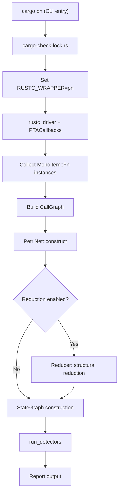

# Architecture and Analysis Pipeline

This document describes the overall architecture and analysis pipeline of RustPTA. RustPTA is a Petri net-based static analysis tool for Rust programs that translates the Rust compiler's Mid-level Intermediate Representation (MIR) into Petri net models, leveraging formal analysis to detect concurrency bugs such as deadlocks, data races, and atomicity violations.

## Architecture Overview



## Entry Mechanism

RustPTA provides two binaries:

- **`cargo-pn`** (`src/bin/cargo-check-lock.rs`): A cargo subcommand that parses `cargo pn` arguments (`-m`, `-p`, `--pn-analysis-dir`, etc.), sets the `RUSTC_WRAPPER` environment variable to point to the `pn` binary, and invokes `cargo build` to trigger compilation and analysis.

- **`pn`** (`src/main.rs`): A Rust compiler wrapper that uses `#![feature(rustc_private)]` to link against compiler-internal crates (`rustc_driver`, `rustc_middle`, etc.). It automatically adds `--sysroot` and `-Z always-encode-mir` flags, then calls `rustc_driver::run_compiler` with injected `PTACallbacks`.

Typical usage:

```bash
cd path/to/your/rust/project
cargo clean
cargo pn -m deadlock -p my_crate --pn-analysis-dir=./tmp --viz-petrinet
```

## Compiler Callbacks

`PTACallbacks` (defined in `src/callback.rs`) implements the `rustc_driver::Callbacks` trait and hooks into the compilation at two points:

1. **`config`**: Disables optimization (`OptLevel::No`) and debug info (`DebugInfo::None`) to preserve full control flow in MIR.

2. **`after_analysis`**: Invoked after type checking and MIR construction are complete, calls `analyze_with_pta` when all MIR bodies are available.

## Analysis Pipeline

The `analyze_with_pta` function (`src/callback.rs`) drives the entire analysis, consisting of the following stages:

### Stage 1: Monomorphic Instance Collection

Uses `tcx.collect_and_partition_mono_items()` to gather all monomorphized function instances from codegen units. Each instance represents a concrete function (after generic specialization) with an available MIR body.

### Stage 2: Call Graph Construction

`CallGraph::analyze` (`src/translate/callgraph.rs`) processes the MIR of all instances to build an inter-procedural call graph. During construction, `KeyApiRegex` identifies key concurrency APIs (`thread::spawn`, `Mutex::lock`, `channel::send`, etc.) and classifies them into different `ThreadControlKind` categories.

When `entry_reachable = true`, only functions reachable from the entry point are retained. When `translate_concurrent_roots = true`, functions using concurrency primitives and their callers are additionally included.

### Stage 3: Petri Net Construction

`PetriNet::construct` (`src/translate/petri_net.rs`) translates MIR into a Petri net through the following steps:

1. **`construct_func`**: Creates start/end place pairs for each reachable function.
2. **`construct_lock_with_dfs`**: Merges aliased lock variants via Union-Find and creates lock resource places.
3. **`construct_channel_resources`**: Identifies Sender/Receiver endpoint pairs and creates channel resource places.
4. **`construct_atomic_resources`**: Creates resource places for atomic variables.
5. **`construct_unsafe_blocks`**: Creates resource places for unsafe memory operations.
6. **`translate_all_functions`**: Iterates over reachable functions, invoking `BodyToPetriNet::translate` to convert each function body's MIR into a Petri net subnet.

### Stage 4: Petri Net Reduction (optional)

When `reduce_net = true`, the `Reducer` (`src/net/reduce/`) applies structural reductions:

- **Simple loop removal**: Eliminates loops containing only zero-token places.
- **Linear sequence merging**: Merges intermediate places and transitions in linear chains.
- **Intermediate place elimination**: Removes places with exactly one input and one output transition.

These reductions preserve behavioral properties (liveness, boundedness, etc.) while significantly reducing the state space.

### Stage 5: State Graph Exploration

`StateGraph::with_config` (`src/analysis/reachability.rs`) performs BFS reachability analysis on the Petri net, constructing the full state graph. Key configuration parameters:

- **`state_limit`**: Maximum states to explore (default: 50,000) to prevent OOM on large projects.
- **`use_por`**: Enables Partial Order Reduction using sleep set techniques to reduce equivalent interleavings.

### Stage 6: Bug Detection

`run_detectors` (`src/callback.rs`) invokes detectors based on `DetectorKind`:

| Mode | Detector | Description |
|------|----------|-------------|
| `deadlock` | `DeadlockDetector` | Finds states with no enabled transitions that are not normal termination states, and cycles containing permanently disabled Lock transitions |
| `datarace` | `DataRaceDetector` | Finds concurrent UnsafeRead/UnsafeWrite conflicts on the same memory location |
| `atomic` | `AtomicityViolationDetector` | Detects Load-Store-Store / Store-Store-Load / Load-Store-Load atomicity violation patterns |
| `all` | Deadlock + DataRace | Runs deadlock and data race detection in parallel |
| `pointsto` | - | Only outputs pointer analysis results without bug detection |

### Stage 7: Report Output

Detection results are output through structured report formats defined in `src/report/mod.rs`, generating both human-readable text files and machine-readable JSON files. Report types include `DeadlockReport`, `RaceReport`, and `AtomicReport`.

## Pipeline Stop Points

RustPTA supports early termination at any pipeline stage for debugging and incremental development:

| `--stop-after` | Stop Point | Purpose |
|----------------|-----------|---------|
| `mir` | After MIR output | Inspect generated MIR |
| `callgraph` | After call graph construction | Check function reachability |
| `pointsto` | After pointer analysis | Inspect alias relationships |
| `petrinet` | After Petri net construction | Examine Petri net structure |
| `stategraph` | After state graph construction | Inspect state space |

## Visualization Output

The `--viz-*` options export DOT-format visualization files for intermediate results:

| Option | Output File | Content |
|--------|------------|---------|
| `--viz-callgraph` | `callgraph.dot` | Function call graph |
| `--viz-petrinet` | `petrinet.dot` | Petri net structure |
| `--viz-stategraph` | `stategraph.dot` | Reachable state graph |
| `--viz-pointsto` | `points_to_report.txt` | Points-to relation report |
| `--viz-mir` | `mir/*.dot` | MIR control flow graph per function |

## Configuration System

RustPTA behavior is controlled by two layers of configuration:

### Command-Line Arguments (`Options`)

Parsed via `clap`, supporting analysis mode selection, target crate specification, visualization output control, etc. See `src/options.rs`.

### Configuration File (`PnConfig`)

A TOML-format configuration file (default: `pn.toml`) providing fine-grained control:

- `state_limit`: Maximum states for reachability exploration
- `entry_reachable`: Whether to only translate entry-reachable functions
- `reduce_net`: Whether to enable Petri net reduction
- `por_enabled`: Whether to enable partial order reduction
- `translate_concurrent_roots`: Whether to additionally translate concurrency-related functions
- `thread_spawn` / `thread_join` / `scope_spawn` / `scope_join`: Thread API regex patterns
- `condvar_notify` / `condvar_wait`: Condition variable API regex patterns
- `channel_send` / `channel_recv`: Channel API regex patterns
- `atomic_load` / `atomic_store`: Atomic operation API regex patterns
- `alias_unknown_policy`: How to handle Unknown alias results (`conservative` or `optimistic`)

## Module Overview

| Module Path | Responsibility |
|-------------|---------------|
| `src/callback.rs` | Compiler callbacks, drives the analysis pipeline |
| `src/options.rs` | Command-line argument definitions and parsing |
| `src/config.rs` | TOML configuration file loading |
| `src/translate/` | MIR-to-Petri-net translation |
| `src/net/` | Petri net core data structures and operations |
| `src/memory/` | Pointer analysis and alias analysis |
| `src/concurrency/` | Concurrency primitive collectors |
| `src/analysis/` | Reachability analysis and boundedness checking |
| `src/detect/` | Bug detectors |
| `src/report/` | Structured report output |
