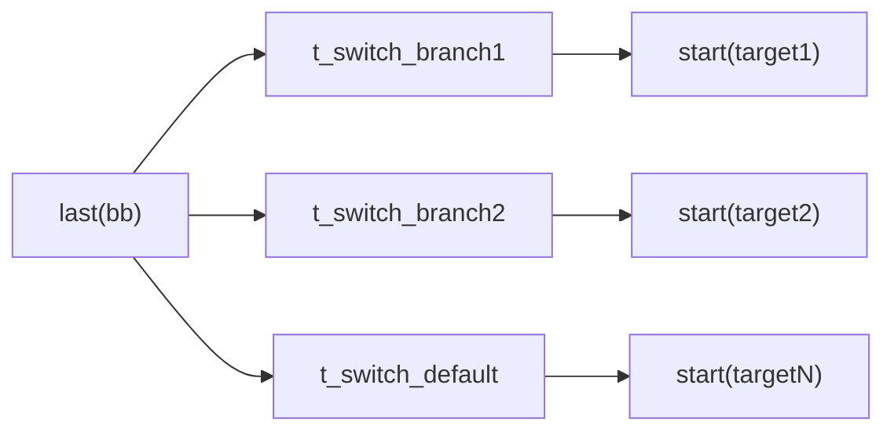
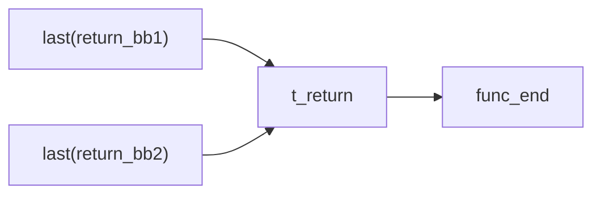
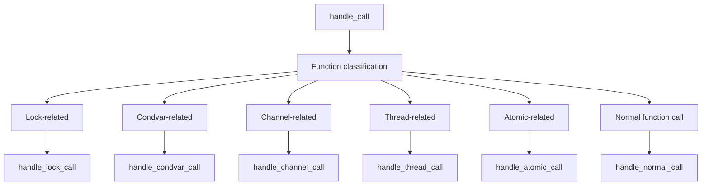
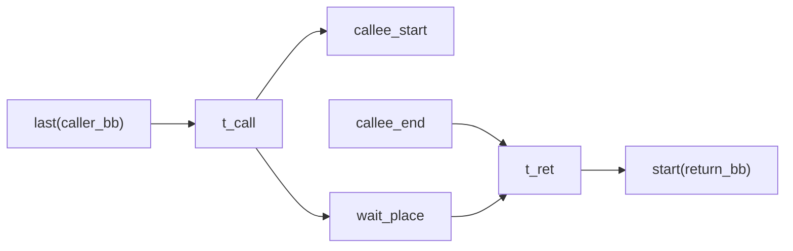
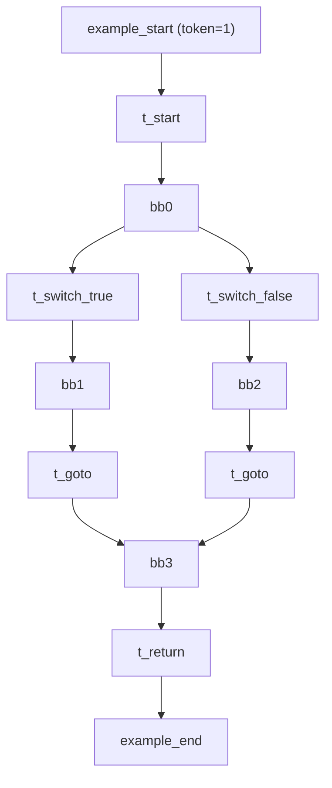

# MIR to Petri Net Mapping

This document provides a detailed description of how Rust's Mid-level Intermediate Representation (MIR) is mapped to Petri net elements. This translation process is the core of RustPTA, transforming program control flow and concurrency behavior into formally analyzable Petri net models.

## Petri Net Fundamentals

In RustPTA, a Petri net consists of the following elements (defined in `src/net/structure.rs` and `src/net/core.rs`):

- **Place**: Holds tokens, representing program state. Each place has a name, initial token count, capacity, and type.
- **Transition**: Represents a program action. Each transition has a name and a type label (`TransitionType`) used for semantic identification in later analysis stages.
- **Arc**: Connects places and transitions with a weight. Input arcs (Place -> Transition) represent preconditions for firing; output arcs (Transition -> Place) represent post-conditions.
- **Marking**: A snapshot of the token distribution across all places, representing the global state at a given moment.

### Place Types (`PlaceType`)

| Type | Meaning |
|------|---------|
| `FunctionStart` | Function entry place |
| `FunctionEnd` | Function exit place |
| `BasicBlock` | Control flow place for a basic block |
| `Resources` | Synchronization resource place (locks, channels, atomics, etc.) |

### Transition Firing Rule

A transition \(t\) is enabled under marking \(M\) if and only if for every input place \(p\):

$$M(p) \geq W(p, t)$$

where \(W(p,t)\) is the input arc weight. After firing, the new marking \(M'\) satisfies:

$$M'(p) = M(p) - W(p, t) + W(t, p)$$

## Overview: MIR-to-Petri-Net Mapping Table

| MIR Concept | Petri Net Element | Implementation |
|-------------|-------------------|----------------|
| Function | start/end place pair | `petri_net.rs::construct_func` |
| Basic Block (BB) | `BasicBlock` place | `terminator.rs::init_basic_block` |
| BB0 entry | `Start` transition | `terminator.rs::handle_start_block` |
| Goto terminator | `Goto` transition | `terminator.rs::handle_goto` |
| SwitchInt terminator | Multiple `Switch` transitions | `terminator.rs::handle_switch` |
| Return terminator | Shared `Return` transition | `terminator.rs::handle_return` |
| Assert terminator | `Assert` transition | `terminator.rs::handle_assert` |
| Function call | Call + Wait + Ret subnet | `calls.rs::handle_normal_call` |
| Drop | `Drop` or `Unlock` transition | `drop_unsafe.rs::handle_drop` |
| Panic/Cleanup | `Panic` transition | `terminator.rs::handle_panic` |
| Unreachable | Terminal transition | `terminator.rs::handle_terminal_block` |
| Unsafe read/write | `UnsafeRead`/`UnsafeWrite` transition | `drop_unsafe.rs` |

## Function-Level Mapping

### Function start/end Place Pair

Each translated function has a pair of places in the Petri net:

- **`func_start`** (`PlaceType::FunctionStart`): When this place holds a token, the function is about to begin execution.
- **`func_end`** (`PlaceType::FunctionEnd`): When this place holds a token, the function has completed execution.

For the entry function `main`, `func_start` has an initial token count of 1 (analysis starting point).

```
func_start --[Start transition]--> bb0_start
                                    ...
bb_return  --[Return transition]--> func_end
```

## Basic Block Mapping

### BasicBlockGraph

`BasicBlockGraph` (defined in `src/translate/mir_to_pn/bb_graph.rs`) maintains the mapping from basic blocks to places:

```rust
pub struct BasicBlockGraph {
    pub start_places: HashMap<BasicBlock, PlaceId>,  // BB -> start place
    pub sequences: HashMap<BasicBlock, Vec<PlaceId>>, // BB -> intermediate place sequence
}
```

- **`start(bb)`**: Returns the entry place for basic block `bb`.
- **`last(bb)`**: Returns the tail place of basic block `bb`. If intermediate places exist in the sequence (generated by unsafe read/write operations), returns the last one; otherwise returns `start(bb)`.
- **`push(bb, place)`**: Appends an intermediate place to the sequence of `bb`, extending the place chain.

### Basic Block Initialization

In `init_basic_block` (`src/translate/mir_to_pn/terminator.rs`), a `BasicBlock`-typed place is created for each non-cleanup, non-unreachable basic block:

```
For each BB in body:
  If bb.is_cleanup or bb.is_empty_unreachable:
    Exclude this BB
  Else:
    Create place "funcName_bbIndex" (PlaceType::BasicBlock)
    Register in bb_graph
```

Cleanup blocks (used for panic unwinding) and unreachable blocks are excluded from translation to simplify the net structure.

### BB0 Entry Connection

The first basic block (BB0) is connected to the function entry place via a `Start` transition:

```
func_start --[input arc]--> t_start --[output arc]--> bb0_start
```

`t_start` has type `TransitionType::Start(instance_id)`, identifying the owning function instance.

## Terminator Mapping

Each MIR basic block ends with a terminator that determines control flow direction. RustPTA generates different Petri net patterns for each terminator kind.

### Goto

The simplest control flow transfer -- an unconditional jump to the target basic block:

```
last(bb_src) --[input arc]--> t_goto --[output arc]--> start(bb_target)
```

If the target is a cleanup block, `handle_panic` is called instead to generate a terminal transition.

### SwitchInt (Conditional Branch)

For each branch target of SwitchInt, an independent `Switch` transition is created, forming a non-deterministic choice structure:



This modeling means the analyzer explores all possible branch paths (path-sensitive analysis).

### Return

All return terminators share a single `Return` transition, converging to the function exit place:



`t_return` has type `TransitionType::Return(instance_id)`.

### Assert

Similar to Goto, but the transition type is marked as `Assert`:

```
last(bb) --> t_assert --> start(target)
```

If the assert's cleanup target points to a cleanup block, a panic transition is generated.

### Drop

The Drop terminator has two behaviors depending on the type of the dropped object:

1. **Regular Drop**: Generates a `Drop` transition connecting to the successor block.
2. **Lock Guard Drop**: When the dropped object is a `MutexGuard`, `RwLockReadGuard`, etc., generates an `Unlock` transition that also returns tokens to the lock resource place.

```
Regular Drop:
  last(bb) --> t_drop --> start(target)

Lock Guard Drop:
  last(bb) --> t_unlock --> start(target)
                  |
                  +--[output arc]--> Mutex_N (return token)
```

### Panic and Terminal Blocks

- **Panic** (`handle_panic`): When a terminator's target is a cleanup block, generates a terminal transition connected to `func_end`, indicating the function exits early due to panic.
- **Unreachable / UnwindResume / UnwindTerminate / CoroutineDrop** (`handle_terminal_block`): Generates a terminal transition connected to `func_end`.

## Function Call Mapping

Function calls are the most complex part of the MIR-to-Petri-net translation, involving inter-procedural analysis.

### Call Dispatch

`handle_call` (`src/translate/mir_to_pn/calls.rs`) first creates a call transition, then dispatches to different handlers based on the callee function type:



### Wait-Ret Subnet for Normal Function Calls

For functions that have been translated (with start/end place pairs in `functions_map`), the wait-ret subnet pattern is used:



**Semantic interpretation**:

1. When `t_call` fires, one token enters `callee_start` to start the callee, and another enters `wait_place` indicating the caller is waiting.
2. When the callee completes, a token arrives at `callee_end`.
3. `t_ret` requires tokens in both `callee_end` and `wait_place` to fire, representing the caller resuming after the callee returns.

### Closure Calls

If a normal call cannot find the callee in `functions_map`, it attempts to resolve closures from arguments (`resolve_closure_places_at`). Closure `DefId`s are identified via `TyKind::Closure` or `TyKind::FnDef`, and their start/end places are retrieved from `functions_map`.

## Statement Processing and BB Extension

MIR basic blocks contain statements in addition to the terminator. Most statements do not affect Petri net structure, but statements involving unsafe memory operations extend the BB's place sequence.

### Unsafe Read/Write Transitions

In `visit_statement_body` (`src/translate/mir_to_pn/drop_unsafe.rs`):

1. **`process_rvalue_reads`**: Analyzes the Rvalue on the right side of a statement, extracting all memory locations (Places). If a place aliases an unsafe resource, an `UnsafeRead` transition and a new intermediate place are inserted into the BB sequence.

2. **`process_place_writes`**: Analyzes the Place being assigned to on the left side. If it aliases an unsafe resource, an `UnsafeWrite` transition and intermediate place are inserted.

The insertion process:

```
Before:  last(bb) --------------------------> [next terminator transition]
After:   last(bb) --> t_unsafe_rw --> new_place --> [next terminator transition]
              |                          ^
              +--- unsafe_resource ------+  (resource place arcs)
```

`push(bb, new_place)` updates the BB's tail place so subsequent terminator transitions depart from `new_place` instead of `bb_start`.

## Key Macros

`src/translate/macros.rs` defines frequently used macros in the translation process:

| Macro | Purpose |
|-------|---------|
| `bb_place!` | Create a basic block place |
| `transition_name!` | Generate a transition name string |
| `add_fallthrough_transition!` | Create a `last(bb) -> t -> start(target)` fallthrough transition |
| `add_terminal_transition!` | Create a `last(bb) -> t -> func_end` terminal transition |
| `add_wait_ret_subnet!` | Create a function call's wait place + ret transition subnet |

## Complete Example

The following illustrates the mapping of a simple Rust function to a Petri net:

```rust
fn example(x: bool) -> i32 {
    let result;
    if x {
        result = 1;
    } else {
        result = 2;
    }
    result
}
```

Simplified MIR structure:

```
bb0: { switchInt(x) -> [true: bb1, false: bb2] }
bb1: { result = 1; goto -> bb3 }
bb2: { result = 2; goto -> bb3 }
bb3: { return result }
```

Corresponding Petri net:


