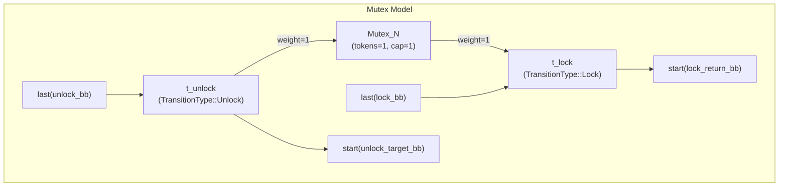
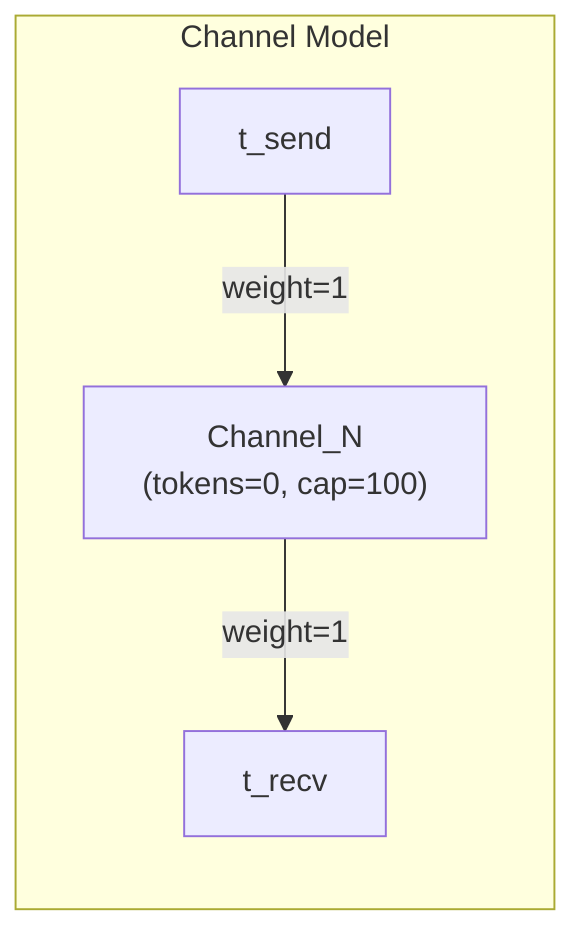
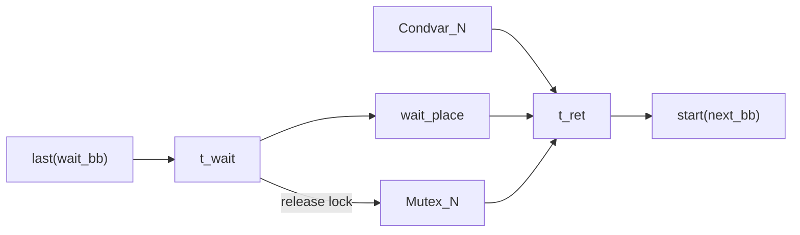
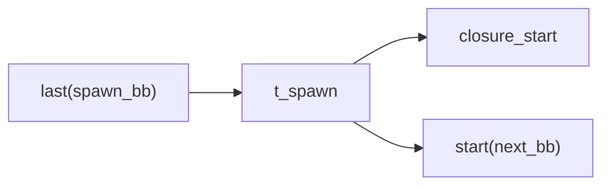
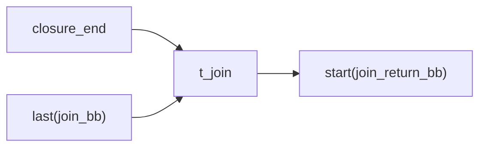
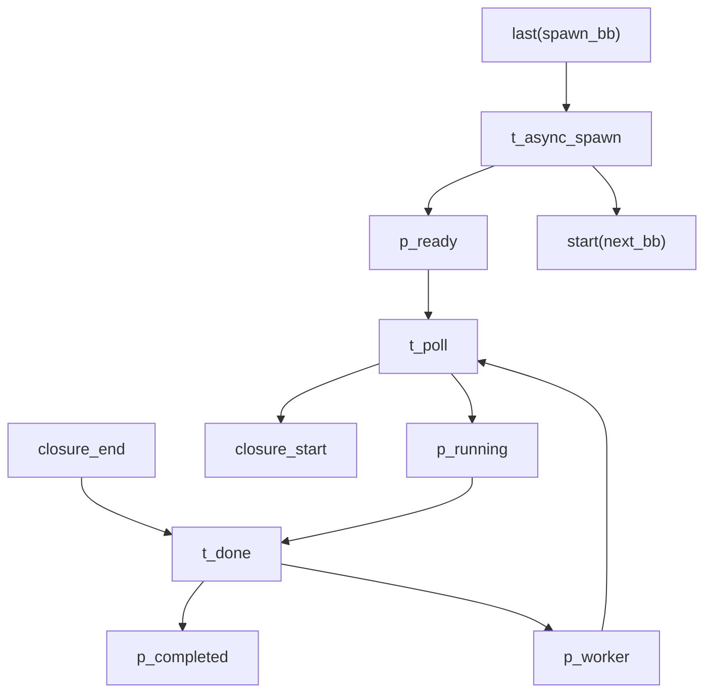

# Petri Net Models for Synchronization Primitives

This document provides detailed descriptions of how RustPTA models various Rust synchronization primitives (Mutex, RwLock, Channel, Condvar, Thread, Async Task, Atomic) as Petri net structures. Each primitive has specific resource places and transition patterns that precisely capture concurrency semantics through token flow.

## Mutex

### Resource Place

Each group of mutexes (equivalence class after alias-based merging) corresponds to a single resource place:

- **Initial tokens**: 1
- **Capacity**: 1

Implemented in `src/translate/petri_net.rs` at `construct_lock_with_dfs`.

### Lock Transition

When code calls `mutex.lock()`, a `Lock`-typed transition is generated with an input arc consuming 1 token from the resource place:

```
Mutex_N --[weight=1]--> t_lock --> start(next_bb)
last(bb) ----------------> t_lock
```

If the resource place has no token (lock is held), `t_lock` is not enabled and the execution path is blocked -- a precise expression of mutual exclusion semantics.

### Unlock Transition

Lock release is triggered in two ways:

1. **Explicit drop**: Code explicitly calls `drop(guard)` or `std::mem::drop(guard)`.
2. **Implicit drop**: `MutexGuard` is automatically dropped when it goes out of scope (MIR `Drop` terminator).

Both cases generate an `Unlock`-typed transition with an output arc returning 1 token to the resource place:

```
last(bb) --> t_unlock --> start(next_bb)
                |
                +--[weight=1]--> Mutex_N (return token)
```

### Complete Mutex Model



### Deadlock Detection Principle

If two threads hold locks A and B respectively, and each attempts to acquire the other's lock, both `Lock` transitions become permanently disabled due to insufficient tokens in resource places. The Petri net enters a deadlock state (no enabled transitions and the normal termination marking has not been reached).

### Lock Alias Merging

RustPTA uses Union-Find to merge lock guards that may reference the same underlying Mutex. For each pair of lock guards, `AliasAnalysis::alias()` is queried. If they may alias (`may_alias` returns `true`), they are merged into the same group sharing a single resource place.

Supported lock types:
- `std::sync::Mutex` / `MutexGuard`
- `parking_lot::Mutex` / `MutexGuard`
- `spin::Mutex` / `MutexGuard`

## RwLock

### Resource Place

- **Initial tokens**: 10
- **Capacity**: 10

A larger token count is used to distinguish between read and write lock concurrency capabilities.

### Read Lock (RwLockRead)

Read lock acquisition consumes 1 token; release returns 1 token. With 10 tokens in the resource place, up to 10 concurrent readers are allowed.

```
RwLock_N --[weight=1]--> t_read_lock
t_read_unlock --[weight=1]--> RwLock_N
```

### Write Lock (RwLockWrite)

Write lock acquisition consumes 10 tokens (draining the resource place); release returns 10 tokens. A write lock claims all tokens, so neither read locks nor other write locks can be acquired concurrently.

```
RwLock_N --[weight=10]--> t_write_lock
t_write_unlock --[weight=10]--> RwLock_N
```

### Concurrency Semantics

| Scenario | Resource place token change | Allowed? |
|----------|---------------------------|----------|
| 1 reader | 10 -> 9 | Yes |
| 10 concurrent readers | 10 -> 0 | Yes (full) |
| 11 concurrent readers | 0 (insufficient) | Blocked |
| 1 writer | 10 -> 0 | Yes (exclusive) |
| 1 writer + 1 reader | 0 (insufficient) | Blocked |
| 2 writers | 0 (insufficient for 10) | Blocked |

## Channel

### Resource Place

Each Sender/Receiver pair shares a resource place:

- **Initial tokens**: 0 (channel starts empty)
- **Capacity**: 100

Implemented in `src/translate/petri_net.rs` at `construct_channel_resources`.

### Sender/Receiver Pairing

`ChannelCollector` (`src/concurrency/channel.rs`) analyzes `Sender<T>` and `Receiver<T>` types in MIR. Alias analysis determines which Senders and Receivers belong to the same channel (originating from the same `channel()` call), associating them with a shared resource place.

### Send Transition

Send operations add 1 token to the channel resource place via an output arc:

```
last(send_bb) --> t_send --> start(next_bb)
                    |
                    +--[weight=1]--> Channel_N (produce token)
```

### Recv Transition

Receive operations consume 1 token from the channel resource place via an input arc:

```
Channel_N --[weight=1]--> t_recv --> start(next_bb)
last(recv_bb) ------------> t_recv
```

If the channel is empty (tokens=0), `t_recv` is not enabled and the receiver blocks.

### Channel Model Diagram



## Condvar (Condition Variable)

### Resource Place

- **Initial tokens**: 1
- **Capacity**: 1

Implemented in `src/translate/petri_net.rs` at `collect_blocking_primitives`.

### Notify Transition

`condvar.notify_one()` or `condvar.notify_all()` generates a `Notify` transition that adds 1 token to the condvar resource place:

```
last(notify_bb) --> t_notify --> start(next_bb)
                       |
                       +--[weight=1]--> Condvar_N
```

### Wait Transition

The semantics of `condvar.wait(guard)` are complex, involving three steps: release lock, wait for notification, reacquire lock. RustPTA models this with a wait-ret subnet:



Arc connection details:

| Arc | Direction | Weight | Meaning |
|-----|-----------|--------|---------|
| `Mutex_N -> t_wait` | Output arc | 1 | Wait releases the lock |
| `Condvar_N -> t_ret` | Input arc | 1 | Wait for notification signal |
| `Mutex_N -> t_ret` | Input arc | 1 | Reacquire lock |
| `wait_place -> t_ret` | Input arc | 1 | Waiting token |

## Thread

### Spawn Transition

`std::thread::spawn(closure)` creates a new thread. In the Petri net, the spawn transition simultaneously starts the closure and continues the caller's execution:



`t_spawn` has two output arcs -- one connecting to the closure's entry place (starting the child thread) and one connecting to the caller's next basic block (caller continues). This produces concurrent execution semantics: tokens appear simultaneously on both paths.

### Join Transition

`handle.join()` waits for the child thread to complete. The join transition requires a token in the child thread's exit place to fire:



### Spawn-Join Matching

`get_matching_spawn_callees(join_id)` uses alias analysis to find the spawn target function corresponding to a join. If the `JoinHandle` may point to multiple spawns (ambiguous alias), the current implementation selects only the first match.

### Scoped Thread spawn/join

Scoped threads (`std::thread::scope`) are handled similarly to regular spawn/join with additional constraints:

- **ScopeSpawn**: The closure's start connects to the spawn transition; the closure's end connects to the scope's return transition, ensuring all scoped threads complete before scope exit.
- **ScopeJoin**: Matches spawns within the scope via `AliasId`.

### Rayon join

`rayon::join(closure_a, closure_b)` is modeled using a wait-ret subnet where multiple closures' end places connect to the same join transition:

```
closure_a_start <-- t_rayon_call --> closure_b_start
                         |
                    wait_place
closure_a_end --> t_join <-- closure_b_end
                    |
               wait_place
                    |
              start(return_bb)
```

## Async Spawn/Join (tokio)

### Task Lifecycle Places

Each async task has three lifecycle places (`src/translate/mir_to_pn/async_control.rs`):

| Place | Meaning |
|-------|---------|
| `p_ready` | Task created, waiting to be polled |
| `p_running` | Task executing on executor |
| `p_completed` | Task execution finished |

### Worker Place

Simulates the executor's worker thread pool. The number of tokens in the worker place represents available worker threads.

### Async Spawn Model



**Key transitions**:

| Transition | Inputs | Outputs | Meaning |
|-----------|--------|---------|---------|
| `t_spawn` | `last(bb)` | `p_ready`, `start(next_bb)` | Create task |
| `t_poll` | `p_ready`, `p_worker` | `p_running`, `closure_start` | Executor schedules task |
| `t_done` | `p_running`, `closure_end` | `p_completed`, `p_worker` | Task completes, return worker |

### Async Join Model

```
p_completed --> t_join --> start(join_return_bb)
last(join_bb) --> t_join
```

Join requires `p_completed` to have a token (task completed) before it can fire.

## Atomic Operations

Atomic operations have two modeling modes depending on whether the `atomic-violation` feature is enabled.

### Basic Mode (default)

Each atomic variable has a resource place (tokens=1, capacity=1). Atomic operations are modeled with a read-modify-write pattern:

```
last(bb) --> t_atomic --> intermediate_place --> ...
                |                    ^
            atomic_var --------------+
            (input+output arc, weight=1)
```

The resource place serves as both input and output (self-loop), ensuring mutual exclusion of operations on the same atomic variable.

### atomic-violation Mode

With the `atomic-violation` feature enabled, finer-grained transition type labels and memory ordering models are used.

#### Transition Types

| Transition Type | Meaning |
|----------------|---------|
| `AtomicLoad(alias, ordering, span, tid)` | Atomic load |
| `AtomicStore(alias, ordering, span, tid)` | Atomic store |
| `AtomicCmpXchg(alias, success_ord, failure_ord, span, tid)` | Atomic compare-and-swap |

#### Memory Ordering Model

Different memory orderings are modeled through segment places that capture happens-before relationships (`src/translate/mir_to_pn/concurrency.rs`):

| Ordering | Petri Net Pattern |
|----------|-------------------|
| `Relaxed` | Self-loop on current segment place (no serialization constraint) |
| `Acquire` / `Release` / `AcqRel` | Token passes from current segment to next segment (establishes happens-before) |
| `SeqCst` | Additional global `SeqCst_Global` place (total ordering) |

```
Relaxed:
  seg_current --[input]--> t_atomic --[output]--> seg_current (self-loop)

Acquire/Release:
  seg_current --[input]--> t_atomic --[output]--> seg_next (advance segment)

SeqCst:
  seg_current + SeqCst_Global --> t_atomic --> seg_next + SeqCst_Global
```

## Synchronization Primitive Recognition

RustPTA identifies synchronization primitives by regex matching on function calls in MIR (configured in `src/config.rs`):

| Primitive | Default Regex Patterns |
|-----------|----------------------|
| Thread Spawn | `std::thread[...]::spawn`, `tokio::task::spawn`, etc. |
| Thread Join | `std::thread[...]::join`, `tokio::task::JoinHandle::await`, etc. |
| Condvar Notify | `condvar[...]::notify` |
| Condvar Wait | `condvar[...]::wait` |
| Channel Send | `mpsc[...]::send` |
| Channel Recv | `mpsc[...]::recv` |
| Atomic Load | `atomic[...]::load` |
| Atomic Store | `atomic[...]::store` |

Lock identification (Mutex/RwLock) is done through `BlockingCollector` (`src/concurrency/blocking.rs`), which analyzes local variables of types `MutexGuard`, `RwLockReadGuard`, `RwLockWriteGuard`, etc. in MIR.

## Resource Registry

`ResourceRegistry` (`src/translate/structure.rs`) maintains mappings from `AliasId` to `PlaceId` for all synchronization resources:

```rust
pub struct ResourceRegistry {
    locks: HashMap<AliasId, PlaceId>,
    condvars: HashMap<AliasId, PlaceId>,
    atomic_places: HashMap<AliasId, Vec<PlaceId>>,
    atomic_orders: HashMap<AliasId, AtomicOrdering>,
    unsafe_places: HashMap<AliasId, PlaceId>,
    channel_places: HashMap<AliasId, PlaceId>,
}
```

During translation, `handle_lock_call`, `handle_channel_call`, and other functions look up the corresponding resource places by alias ID to establish correct arc connections.

## Summary: Synchronization Primitive Reference Table

| Primitive | Resource Place | Initial Tokens | Acquire (consume) | Release (return) |
|-----------|---------------|----------------|-------------------|-----------------|
| Mutex | `Mutex_N` | 1 | Lock: 1 | Unlock: 1 |
| RwLock (Read) | `RwLock_N` | 10 | RwLockRead: 1 | Unlock: 1 |
| RwLock (Write) | `RwLock_N` | 10 | RwLockWrite: 10 | Unlock: 10 |
| Channel | `Channel_N` | 0 | - | Send: +1 |
| Channel (Recv) | `Channel_N` | 0 | Recv: 1 | - |
| Condvar | `Condvar_N` | 1 | Wait: 1 (via ret) | Notify: +1 |
| Atomic | `Atomic_N` | 1 | Self-loop: 1 | Self-loop: 1 |
