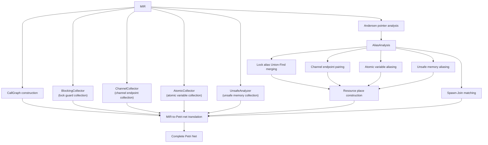
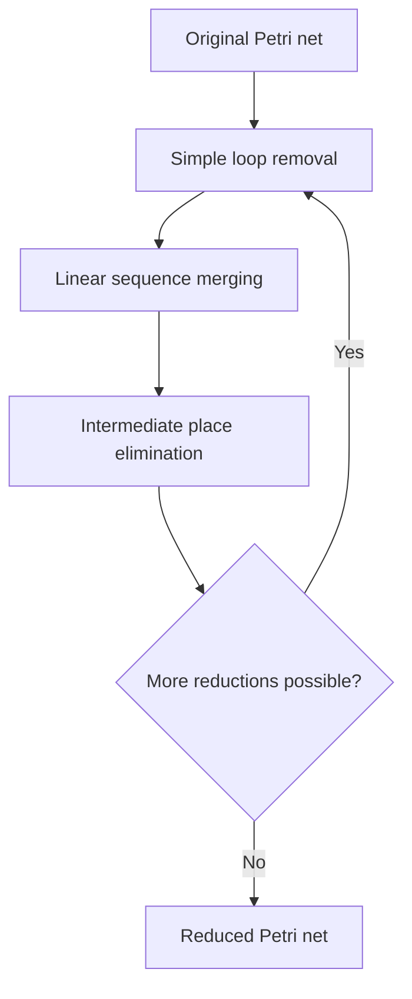
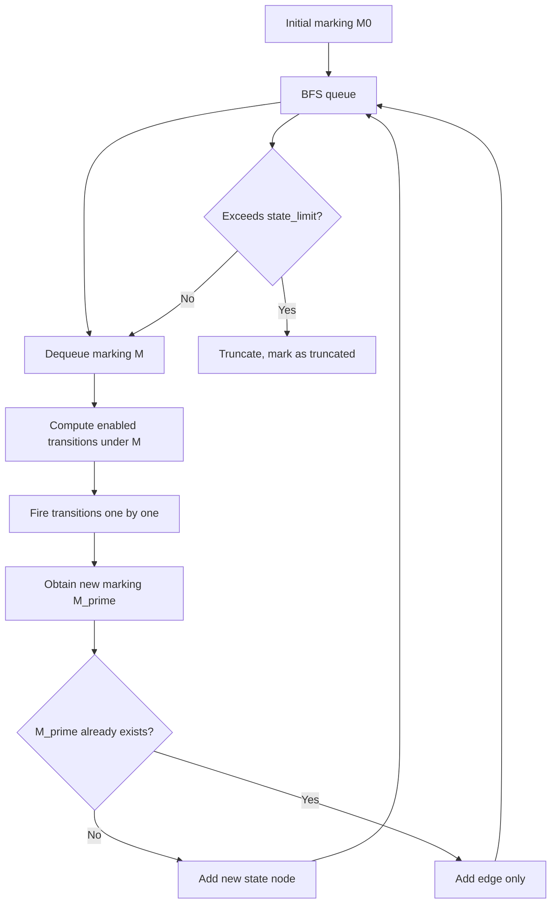

# Pointer Analysis and Bug Detection

This document describes how pointer analysis integrates with Petri net construction in RustPTA, along with the state space exploration, Petri net reduction, and three bug detection algorithms.

## Integrating Pointer Analysis with Petri Nets

Pointer analysis is a critical prerequisite for Petri net construction. It addresses the core challenge: when multiple variables may reference the same lock, channel, or atomic variable, how to correctly associate them with the same resource place in the Petri net.



### Andersen Pointer Analysis

RustPTA implements a constraint-based Andersen-style pointer analysis (`src/memory/pointsto.rs`), a flow-insensitive whole-program pointer analysis.

#### Constraint Graph

The core of the analysis is building a constraint graph where nodes and edges represent pointer relationships:

**Constraint Nodes (`ConstraintNode`)**:
| Node Type | Meaning |
|-----------|---------|
| `Alloc(PlaceRef)` | Memory allocation site |
| `Place(PlaceRef)` | Program memory location |
| `Constant` | Constant |
| `ConstantDeref` | Dereference of a constant |

**Constraint Edges (`ConstraintEdge`)**:
| Edge Type | Meaning | Corresponding MIR Operation |
|-----------|---------|---------------------------|
| `Address` | Address-of (`&x`) | `Rvalue::Ref` |
| `Copy` | Copy assignment (`a = b`) | `Rvalue::Use` |
| `Load` | Load (`a = *b`) | Dereference read |
| `Store` | Store (`*a = b`) | Dereference write |
| `AliasCopy` | Special alias copy | `Arc/Rc::clone`, etc. |

#### Worklist Solving

`ConstraintGraphCollector` traverses all function MIR bodies to generate the constraint graph, then propagates points-to information via a worklist algorithm until a fixed point is reached:

1. Initialization: Each `Alloc` node's points-to set contains itself.
2. Propagation rules:
   - `Address(a -> b)`: `pts(b) ⊇ {a}`
   - `Copy(a -> b)`: `pts(b) ⊇ pts(a)`
   - `Load(a -> b)`: For each `c` in `pts(a)`, `pts(b) ⊇ pts(c)`
   - `Store(a -> b)`: For each `c` in `pts(b)`, `pts(c) ⊇ pts(a)`
3. Supports field propagation for struct field aliasing.

#### Special Handling

- **`Arc/Rc::clone`**: Recognized as `AliasCopy`, ensuring cloned references point to the same object.
- **`ptr::read`**: Treated as a load operation.
- **Index operations**: `container.index()` treated as a load.

### Alias Analysis Interface

`AliasAnalysis` (`src/memory/pointsto.rs`) provides a unified alias query interface:

```rust
pub struct AliasId {
    instance_id: usize,         // Function instance ID
    local: usize,               // MIR local variable index
    array_index: Option<usize>, // Array index (distinguishes arr[0] from arr[1])
}
```

**Alias Query Results (`ApproximateAliasKind`)**:
| Result | Meaning |
|--------|---------|
| `Probably` | Highly likely alias (same allocation site) |
| `Possibly` | May alias (points-to sets intersect) |
| `Unlikely` | Unlikely to alias |
| `Unknown` | Cannot determine |

**Alias Unknown Policy (`AliasUnknownPolicy`)**:
- **`Conservative` (sound)**: Treats `Unknown` as `Possibly`, adds arc connections, reduces false negatives but may increase false positives.
- **`Optimistic`**: Treats `Unknown` as `Unlikely`, does not add arcs, reduces false positives but may increase false negatives.

### Alias Analysis Applications in Petri Net Construction

| Application | Implementation | Purpose |
|-------------|---------------|---------|
| Lock alias merging | `petri_net.rs::construct_lock_with_dfs` | Merges guards that may reference the same Mutex into a single resource place |
| Channel endpoint pairing | `petri_net.rs::construct_channel_resources` | Associates Sender and Receiver of the same channel with a shared resource place |
| Spawn-Join matching | `callgraph.rs::get_matching_spawn_callees` | Determines the spawn target function for a `JoinHandle` |
| Unsafe memory conflicts | `drop_unsafe.rs::process_rvalue_reads/writes` | Determines whether memory operations involve unsafe shared resources |
| Atomic variable aliasing | `petri_net.rs::construct_atomic_resources` | Merges aliases pointing to the same atomic variable |

## Petri Net Reduction

Petri net reduction (`src/net/reduce/`) applies structural transformations to shrink the net while preserving behavioral properties (liveness, boundedness, reachability, etc.).

### Reduction Framework

`Reducer` sequentially applies three reduction rules, each potentially applied multiple times until no further reduction is possible:



### Simple Loop Removal (`loop_removal.rs`)

**Conditions**:
- A place chain \(p_1, p_2, \ldots, p_k\) and transition chain \(t_1, t_2, \ldots, t_k\) form a simple loop.
- Each place is not of type `Resources`, with \(|\bullet p| = |p\bullet| = 1\).
- Each transition has \(|\bullet t| = |t\bullet| = 1\).
- All places have 0 tokens.

**Operation**: Remove all places and transitions in the loop.

### Linear Sequence Merging (`sequence_merge.rs`)

**Conditions**:
- A linear chain \(p_1 \to t_1 \to p_2 \to t_2 \to \ldots \to p_k\) with chain length \(k \geq 2\).
- Intermediate places are not `Resources` type, with \(|\bullet p_i| = |p_i\bullet| = 1\).
- Intermediate transitions have \(|\bullet t_i| = |t_i\bullet| = 1\).
- Consistent arc weights.

**Operation**: Create a new transition directly connecting \(p_1\) and \(p_k\), remove intermediate places and transitions.

### Intermediate Place Elimination (`intermediate_place.rs`)

**Conditions**:
- Place \(p\) has 0 tokens, is not `Resources` type.
- Unique input transition \(t_{in}\), unique output transition \(t_{out}\).
- \(|t_{in}\bullet| = |\bullet t_{out}| = 1\), with equal arc weights.

**Operation**: Create a new transition with inputs from \(\bullet t_{in}\) and outputs to \(t_{out}\bullet\), remove \(p\), \(t_{in}\), and \(t_{out}\).

### Reduction Tracing

`ReductionTrace` records place and transition ID mappings before and after reduction, ensuring analysis results from the reduced net can be traced back to positions in the original net.

## State Space Exploration

### State Graph Construction

`StateGraph` (`src/analysis/reachability.rs`) performs BFS reachability analysis on the Petri net, constructing the complete state graph:



**State Node (`StateNode`)**: Contains the current marking, per-place token snapshots, and list of enabled transitions.

**State Edge (`StateEdge`)**: Records the fired transition, token changes, and arc snapshots.

### Partial Order Reduction (POR)

POR reduces equivalent interleaving exploration through the sleep set technique:

1. **Independence check**: `transitions_are_independent(t1, t2)` verifies that two transitions share no places (no conflict).
2. **Sleep set**: Each state maintains a sleep set. Independent transitions already explored in sibling states are not re-explored.

POR can significantly reduce state count while preserving detectability of deadlocks and other safety properties.

### Boundedness Analysis

`BoundnessAnalyzer` (`src/analysis/boundness.rs`) checks whether the Petri net is bounded:

1. **P-invariant method**: If positive P-invariants exist (requires `invariants` feature), the net is bounded.
2. **Coverability tree method**: Constructs a coverability tree. If omega markings appear (unbounded growth), the net is unbounded, and a witness sequence is generated by backtracking.

## Bug Detection

### Deadlock Detection (`src/detect/deadlock.rs`)

`DeadlockDetector` identifies two deadlock patterns in the state graph:

#### Reachability Deadlock

Finds states with no outgoing edges (deadlock markings) where the state is not a normal termination (the `func_end` place of `main` has no tokens).

**Criteria**:
- State has no outgoing edges (no enabled transitions)
- `func_end` place has 0 tokens (program did not terminate normally)

#### Cyclic Deadlock

Finds strongly connected components (SCCs) or cycles in the state graph, checking whether any cycle contains permanently disabled `Lock`/`RwLockRead`/`RwLockWrite` transitions.

**Criteria**:
- A state cycle exists
- At least one `Lock` transition is disabled in every state within the cycle

### Data Race Detection (`src/detect/datarace.rs`)

`DataRaceDetector` identifies unsafe concurrent access to the same memory location in the reachable state graph.

**Detection logic**:

1. For each reachable state, collect all enabled `UnsafeRead(alias_id, ...)` and `UnsafeWrite(alias_id, ...)` transitions.
2. Group by `alias_id` (memory location identifier).
3. If the same `alias_id` has at least two concurrent operations with at least one being a write, report a data race.

**Key dependencies**:

- `UnsafeRead`/`UnsafeWrite` transitions are generated by `process_rvalue_reads`/`process_place_writes` in `drop_unsafe.rs`.
- Only operations confirmed through unsafe alias analysis to involve shared unsafe memory generate these transitions.

### Atomicity Violation Detection

Atomicity violation detection has two implementations depending on whether the `atomic-violation` feature is enabled.

#### StateGraph-based Detection (`src/detect/atomicity_violation.rs`)

Uses three rules to search for atomicity-violating operation patterns in reachable state sequences:

| Pattern | Meaning | Risk |
|---------|---------|------|
| Load-Store-Store (AV1) | Thread A reads, Thread B writes, Thread A writes | Lost update |
| Store-Store-Load (AV2) | Thread A writes, Thread B writes, Thread A reads | Reading unexpected value |
| Load-Store-Load (AV3) | Thread A reads, Thread B writes, Thread A reads | Non-repeatable read |

Uses `StateFingerprint` for deduplication to avoid reporting the same violation pattern multiple times.

#### Petri-net-based Detection (`src/detect/atomic_violation_detector.rs`)

Operates directly on the Petri net without requiring a pre-built complete state graph:

1. Collects all `AtomicLoad` and `AtomicStore` transitions.
2. For each load, searches along predecessor edges (reverse) for stores that may execute before it.
3. If the same atomic variable has 1 load and at least 2 stores from different threads, and memory ordering allows reordering (`ordering_allows`), reports an atomicity violation.

**Memory ordering matching rules**:
| Load Ordering | Allowed Store Orderings |
|--------------|------------------------|
| `Acquire` | `Release`, `AcqRel`, `SeqCst` |
| `SeqCst` | `SeqCst` only |
| `Relaxed` | All |

## Report Output

Detection results are output through structured reports (`src/report/mod.rs`), generating both text and JSON formats.

### DeadlockReport

```json
{
  "tool_name": "Petri Net Deadlock Detector",
  "has_deadlock": true,
  "deadlock_count": 1,
  "deadlock_states": [
    {
      "state_id": 42,
      "marking": { "Mutex_0": 0, "Mutex_1": 0, "bb3_thread1": 1, "bb5_thread2": 1 },
      "description": "Both threads blocked waiting for each other's lock"
    }
  ],
  "traces": ["..."],
  "analysis_time": "0.123s",
  "state_space_info": { "states": 150, "edges": 200 }
}
```

### RaceReport

```json
{
  "tool_name": "Petri Net Data Race Detector",
  "has_race": true,
  "race_count": 1,
  "race_conditions": [
    {
      "operations": [
        { "operation_type": "UnsafeWrite", "variable": "shared_var", "location": "src/main.rs:15" },
        { "operation_type": "UnsafeRead", "variable": "shared_var", "location": "src/main.rs:22" }
      ],
      "variable_info": "shared_var",
      "state": 55
    }
  ]
}
```

### AtomicReport

```json
{
  "tool_name": "Petri Net Atomic Violation Detector",
  "has_violation": true,
  "violation_count": 1,
  "violations": [
    {
      "load_op": { "operation_type": "load@tid0", "ordering": "Relaxed", "variable": "counter" },
      "store_ops": [
        { "operation_type": "store@tid1", "ordering": "Relaxed", "variable": "counter" },
        { "operation_type": "store@tid0", "ordering": "Relaxed", "variable": "counter" }
      ]
    }
  ]
}
```

## Known Limitations

See `limition.md` for full details. Key limitations include:

1. **Alias analysis precision**: Resource contention handling tends toward under-approximation, potentially missing bugs.
2. **Memory model**: Petri net modeling of Acquire/Release is heuristic; Relaxed ordering handling is simplified.
3. **Control flow**: Infinite recursion is not supported; panic paths are simplified.
4. **FFI**: Analysis of C/C++ code is not supported.
