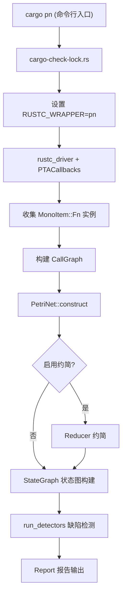

# 架构与分析流水线

本文档描述 RustPTA 工具的整体架构设计和分析流水线。RustPTA 是一个基于 Petri 网的 Rust 程序静态分析工具，通过将 Rust 编译器中间表示 (MIR) 转换为 Petri 网模型，利用 Petri 网的形式化分析能力检测死锁、数据竞争和原子性违反等并发缺陷。

## 整体架构



## 入口机制

RustPTA 提供两个二进制程序：

- **`cargo-pn`** (`src/bin/cargo-check-lock.rs`)：作为 cargo 子命令运行，解析 `cargo pn` 后的参数（`-m`、`-p`、`--pn-analysis-dir` 等），然后设置环境变量 `RUSTC_WRAPPER` 指向 `pn` 二进制，再调用 `cargo build` 触发编译与分析。

- **`pn`** (`src/main.rs`)：作为 Rust 编译器的包装器（wrapper）被调用。它使用 `#![feature(rustc_private)]` 链接编译器内部 crate（`rustc_driver`、`rustc_middle` 等），自动为编译器添加 `--sysroot` 和 `-Z always-encode-mir` 参数，随后调用 `rustc_driver::run_compiler` 启动编译流程，并注入 `PTACallbacks` 回调。

典型使用方式：

```bash
cd path/to/your/rust/project
cargo clean
cargo pn -m deadlock -p my_crate --pn-analysis-dir=./tmp --viz-petrinet
```

## 编译器回调

`PTACallbacks`（定义于 `src/callback.rs`）实现了 `rustc_driver::Callbacks` trait，在两个时机介入编译流程：

1. **`config`**：关闭优化（`OptLevel::No`）和调试信息（`DebugInfo::None`），确保 MIR 保留完整的控制流结构。

2. **`after_analysis`**：在编译器完成类型检查和 MIR 构建后调用 `analyze_with_pta`，此时所有 MIR body 均已可用。

## 分析流水线

`analyze_with_pta` 函数（`src/callback.rs`）驱动整个分析过程，包含以下阶段：

### 阶段 1：单态实例收集

通过 `tcx.collect_and_partition_mono_items()` 获取所有代码生成单元中的单态函数实例。这些实例包含了泛型特化后的具体函数，每个实例都有对应的 MIR body。

### 阶段 2：调用图构建

`CallGraph::analyze`（`src/translate/callgraph.rs`）分析所有实例的 MIR，识别函数调用关系。调用图构建过程中会通过 `KeyApiRegex` 识别关键并发 API（`thread::spawn`、`Mutex::lock`、`channel::send` 等），并分类为不同的 `ThreadControlKind`。

如果配置了 `entry_reachable = true`，则仅保留从入口函数可达的函数子集。如果配置了 `translate_concurrent_roots = true`，则额外包含使用了并发原语的函数及其调用者。

### 阶段 3：Petri 网构建

`PetriNet::construct`（`src/translate/petri_net.rs`）将 MIR 翻译为 Petri 网，具体步骤包括：

1. **`construct_func`**：为每个可达函数创建 start/end 库所对。
2. **`construct_lock_with_dfs`**：通过别名分析和 Union-Find 合并同一锁的变体，创建锁资源库所。
3. **`construct_channel_resources`**：识别 channel 的 Sender/Receiver 端点对，创建 channel 资源库所。
4. **`construct_atomic_resources`**：为原子变量创建资源库所。
5. **`construct_unsafe_blocks`**：为 unsafe 内存操作创建资源库所。
6. **`translate_all_functions`**：遍历可达函数，调用 `BodyToPetriNet::translate` 将每个函数体的 MIR 翻译为 Petri 网子网。

### 阶段 4：Petri 网约简（可选）

当配置 `reduce_net = true` 时，使用 `Reducer`（`src/net/reduce/`）对 Petri 网执行结构约简，包括：

- **简单环消除**：移除仅包含空 token 库所的简单环。
- **线性序列合并**：将线性链中的中间库所和变迁合并。
- **中介库所消除**：移除仅有一个前驱和一个后继变迁的中间库所。

这些约简保持网的行为属性（活性、有界性等），同时显著减小状态空间。

### 阶段 5：状态图探索

`StateGraph::with_config`（`src/analysis/reachability.rs`）对 Petri 网进行 BFS 可达性分析，生成完整的状态图。关键配置参数：

- **`state_limit`**：状态探索上限（默认 50,000），防止大型项目导致 OOM。
- **`use_por`**：启用偏序约简 (Partial Order Reduction)，通过 sleep set 技术减少等价交错。

### 阶段 6：缺陷检测

`run_detectors`（`src/callback.rs`）根据 `DetectorKind` 运行不同的检测器：

| 检测模式 | 检测器 | 说明 |
|---------|--------|------|
| `deadlock` | `DeadlockDetector` | 在状态图中检测无出边的非正常终止状态和包含不可使能 Lock 变迁的环 |
| `datarace` | `DataRaceDetector` | 在并发可达状态中检测对同一内存位置的 UnsafeRead/UnsafeWrite 冲突 |
| `atomic` | `AtomicityViolationDetector` | 检测 Load-Store-Store / Store-Store-Load / Load-Store-Load 等原子性违反模式 |
| `all` | Deadlock + DataRace | 并行运行死锁和数据竞争检测 |
| `pointsto` | - | 仅输出指针分析结果，不进行缺陷检测 |

### 阶段 7：报告输出

检测结果通过 `src/report/mod.rs` 中定义的结构化报告格式输出，同时生成人类可读的文本文件和机器可读的 JSON 文件。报告类型包括 `DeadlockReport`、`RaceReport` 和 `AtomicReport`。

## 流水线停止点

RustPTA 支持在流水线的任意阶段提前停止，便于调试和增量开发：

| `--stop-after` | 停止点 | 用途 |
|----------------|--------|------|
| `mir` | MIR 输出后 | 查看生成的 MIR |
| `callgraph` | 调用图构建后 | 检查函数可达性 |
| `pointsto` | 指针分析后 | 检查别名关系 |
| `petrinet` | Petri 网构建后 | 查看 Petri 网结构 |
| `stategraph` | 状态图构建后 | 查看状态空间 |

## 可视化输出

通过 `--viz-*` 系列选项可导出中间结果的 DOT 格式可视化文件：

| 选项 | 输出文件 | 内容 |
|------|---------|------|
| `--viz-callgraph` | `callgraph.dot` | 函数调用图 |
| `--viz-petrinet` | `petrinet.dot` | Petri 网结构 |
| `--viz-stategraph` | `stategraph.dot` | 可达状态图 |
| `--viz-pointsto` | `points_to_report.txt` | 指针指向关系报告 |
| `--viz-mir` | `mir/*.dot` | 各函数的 MIR 控制流图 |

## 配置系统

RustPTA 的行为由两层配置控制：

### 命令行参数 (`Options`)

通过 `clap` 解析，支持分析模式选择、目标 crate 指定、可视化输出控制等。详见 `src/options.rs`。

### 配置文件 (`PnConfig`)

通过 TOML 格式的配置文件（默认 `pn.toml`）提供更精细的控制，包括：

- `state_limit`：状态探索上限
- `entry_reachable`：是否仅翻译入口可达函数
- `reduce_net`：是否启用 Petri 网约简
- `por_enabled`：是否启用偏序约简
- `translate_concurrent_roots`：是否额外翻译并发相关函数
- `thread_spawn` / `thread_join` / `scope_spawn` / `scope_join`：线程 API 正则模式
- `condvar_notify` / `condvar_wait`：条件变量 API 正则模式
- `channel_send` / `channel_recv`：通道 API 正则模式
- `atomic_load` / `atomic_store`：原子操作 API 正则模式
- `alias_unknown_policy`：别名分析的未知结果策略（`conservative` 或 `optimistic`）

## 核心模块一览

| 模块路径 | 职责 |
|---------|------|
| `src/callback.rs` | 编译器回调，驱动分析流水线 |
| `src/options.rs` | 命令行参数定义与解析 |
| `src/config.rs` | TOML 配置文件加载 |
| `src/translate/` | MIR 到 Petri 网的翻译 |
| `src/net/` | Petri 网核心数据结构与操作 |
| `src/memory/` | 指针分析与别名分析 |
| `src/concurrency/` | 并发原语收集器 |
| `src/analysis/` | 可达性分析与有界性检查 |
| `src/detect/` | 缺陷检测器 |
| `src/report/` | 结构化报告输出 |
