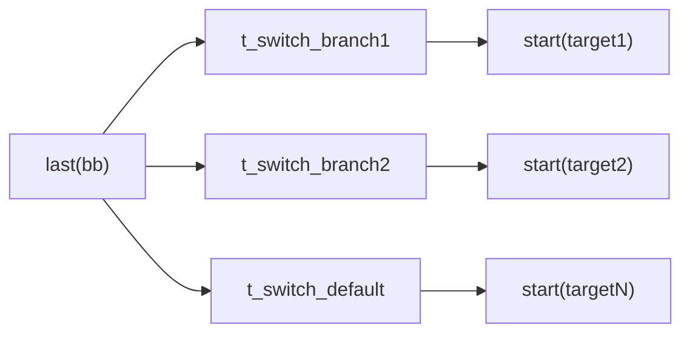
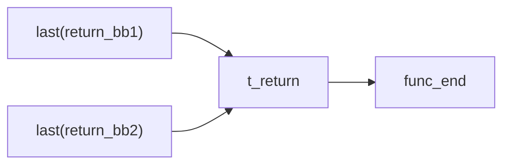
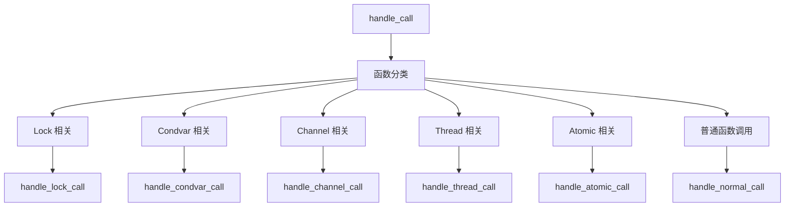
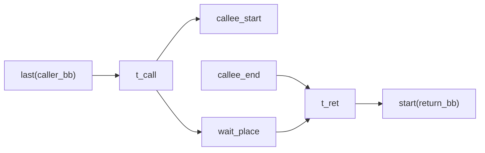
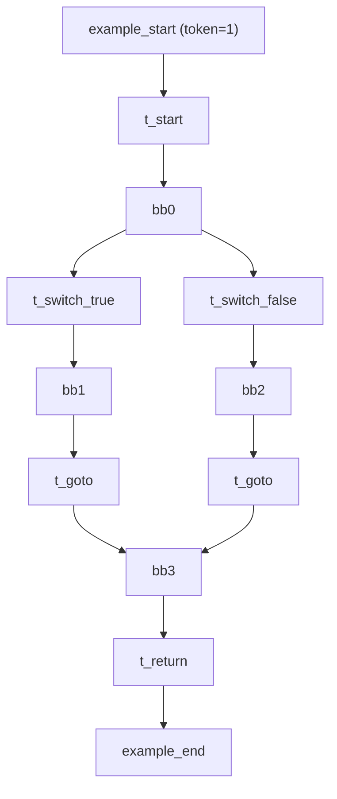

# MIR 到 Petri 网的映射关系

本文档详细描述 Rust 编译器中间表示 (MIR) 到 Petri 网的映射规则。这一翻译过程是 RustPTA 的核心，它将程序的控制流和并发行为转化为可进行形式化验证的 Petri 网模型。

## Petri 网基础

在 RustPTA 中，Petri 网由以下元素组成（定义于 `src/net/structure.rs` 和 `src/net/core.rs`）：

- **库所 (Place)**：持有 token，表示程序状态。每个库所有名称、初始 token 数量、容量和类型。
- **变迁 (Transition)**：表示程序动作。每个变迁有名称和类型标签（`TransitionType`），用于后续分析阶段识别语义。
- **弧 (Arc)**：连接库所和变迁，具有权重。输入弧 (Place → Transition) 表示变迁发生的前提条件；输出弧 (Transition → Place) 表示变迁发生后的效果。
- **标识 (Marking)**：所有库所中 token 分布的快照，表示网在某一时刻的全局状态。

### 库所类型 (`PlaceType`)

| 类型 | 含义 |
|------|------|
| `FunctionStart` | 函数入口库所 |
| `FunctionEnd` | 函数出口库所 |
| `BasicBlock` | 基本块对应的控制流库所 |
| `Resources` | 同步资源库所（锁、通道、原子变量等） |

### 变迁发生规则

变迁 $t$ 在标识 $M$ 下可使能（enabled），当且仅当对每个输入库所 $p$：

$$M(p) \geq W(p, t)$$

其中 $W(p,t)$ 是输入弧权重。变迁发生后，新标识 $M'$ 满足：

$$M'(p) = M(p) - W(p, t) + W(t, p)$$

## 总览：MIR 到 Petri 网映射表

| MIR 概念 | Petri 网元素 | 实现位置 |
|----------|-------------|---------|
| 函数 | start/end 库所对 | `petri_net.rs::construct_func` |
| 基本块 (BB) | `BasicBlock` 类型库所 | `terminator.rs::init_basic_block` |
| BB0 入口 | `Start` 类型变迁 | `terminator.rs::handle_start_block` |
| Goto 终止符 | `Goto` 类型变迁 | `terminator.rs::handle_goto` |
| SwitchInt 终止符 | 多个 `Switch` 类型变迁 | `terminator.rs::handle_switch` |
| Return 终止符 | 共享 `Return` 类型变迁 | `terminator.rs::handle_return` |
| Assert 终止符 | `Assert` 类型变迁 | `terminator.rs::handle_assert` |
| 函数调用 | Call + Wait + Ret 子网 | `calls.rs::handle_normal_call` |
| Drop | `Drop` 或 `Unlock` 类型变迁 | `drop_unsafe.rs::handle_drop` |
| Panic/Cleanup | `Panic` 类型变迁 | `terminator.rs::handle_panic` |
| Unreachable | 终止变迁 | `terminator.rs::handle_terminal_block` |
| Unsafe 读写 | `UnsafeRead`/`UnsafeWrite` 变迁 | `drop_unsafe.rs` |

## 函数级映射

### 函数 start/end 库所对

每个被翻译的函数在 Petri 网中都有一对库所：

- **`func_start`**（`PlaceType::FunctionStart`）：当此库所持有 token 时，表示函数即将开始执行。
- **`func_end`**（`PlaceType::FunctionEnd`）：当此库所持有 token 时，表示函数已执行完毕。

对于入口函数 `main`，`func_start` 的初始 token 数为 1（分析起点）。

```
func_start ──[Start变迁]──> bb0_start
                             ...
bb_return  ──[Return变迁]──> func_end
```

## 基本块级映射

### BasicBlockGraph

`BasicBlockGraph`（定义于 `src/translate/mir_to_pn/bb_graph.rs`）维护基本块到库所的映射关系：

```rust
pub struct BasicBlockGraph {
    pub start_places: HashMap<BasicBlock, PlaceId>,  // BB -> 起始库所
    pub sequences: HashMap<BasicBlock, Vec<PlaceId>>, // BB -> 中间库所序列
}
```

- **`start(bb)`**：返回基本块 `bb` 的入口库所。
- **`last(bb)`**：返回基本块 `bb` 的末尾库所。如果存在中间库所序列（由 unsafe 读写操作产生），则返回序列中的最后一个库所；否则返回 `start(bb)`。
- **`push(bb, place)`**：向基本块 `bb` 的序列中追加一个中间库所，用于扩展 BB 的库所链。

### 基本块初始化

在 `init_basic_block`（`src/translate/mir_to_pn/terminator.rs`）中，对每个非 cleanup、非 unreachable 的基本块创建一个 `BasicBlock` 类型库所：

```
对 body 中的每个 BB：
  如果 bb.is_cleanup 或 bb.is_empty_unreachable：
    排除该 BB
  否则：
    创建库所 "funcName_bbIndex"（PlaceType::BasicBlock）
    注册到 bb_graph
```

Cleanup 基本块（用于 panic unwind）和 unreachable 基本块被排除在翻译范围之外，简化网结构。

### BB0 入口连接

第一个基本块 (BB0) 通过 `Start` 变迁连接到函数入口库所：

```
func_start ──[输入弧]──> t_start ──[输出弧]──> bb0_start
```

`t_start` 的类型为 `TransitionType::Start(instance_id)`，用于标识所属函数实例。

## 终止符 (Terminator) 映射

MIR 中每个基本块以一个终止符结束，决定控制流的去向。RustPTA 对每种终止符生成不同的 Petri 网模式。

### Goto

最简单的控制流转移——无条件跳转到目标基本块：

```
last(bb_src) ──[输入弧]──> t_goto ──[输出弧]──> start(bb_target)
```

如果目标是 cleanup 基本块，则改为调用 `handle_panic` 生成终止变迁。

### SwitchInt（条件分支）

对 SwitchInt 的每个分支目标创建一个独立的 `Switch` 变迁，形成非确定性选择结构：



这种建模方式意味着分析器会探索所有可能的分支路径（路径敏感分析）。

### Return

所有 return 终止符共享同一个 `Return` 变迁，汇聚到函数出口库所：



`t_return` 的类型为 `TransitionType::Return(instance_id)`。

### Assert

与 Goto 类似，但变迁类型标记为 `Assert`：

```
last(bb) ──> t_assert ──> start(target)
```

如果 assert 的 cleanup 目标指向 cleanup 基本块，则生成 panic 变迁。

### Drop

Drop 终止符根据被 drop 的对象类型有两种行为：

1. **普通 Drop**：生成 `Drop` 变迁，连接到后继基本块。
2. **锁守卫 Drop**：当 drop 的对象是 `MutexGuard`、`RwLockReadGuard` 等锁守卫时，生成 `Unlock` 变迁，同时向锁资源库所归还 token。

```
普通 Drop:
  last(bb) ──> t_drop ──> start(target)

锁守卫 Drop:
  last(bb) ──> t_unlock ──> start(target)
                   |
                   └──[输出弧]──> Mutex_N（归还 token）
```

### Panic 与终止块

- **Panic**（`handle_panic`）：当终止符的目标是 cleanup 基本块时，生成一个连接到 `func_end` 的终止变迁，表示函数因 panic 提前退出。
- **Unreachable / UnwindResume / UnwindTerminate / CoroutineDrop**（`handle_terminal_block`）：生成连接到 `func_end` 的终止变迁。

## 函数调用映射

函数调用是 MIR 到 Petri 网翻译中最复杂的部分，涉及过程间分析。

### 调用分发

`handle_call`（`src/translate/mir_to_pn/calls.rs`）首先创建一个 call 变迁，然后根据被调函数的类型分发到不同的处理逻辑：



### 普通函数调用的 Wait-Ret 子网

对已被翻译的函数（在 `functions_map` 中存在 start/end 库所对），使用 wait-ret 子网模式：



**语义解释**：

1. `t_call` 发生时，一个 token 进入 `callee_start` 启动被调函数，另一个 token 进入 `wait_place` 表示调用者在等待。
2. 被调函数执行完毕后，token 到达 `callee_end`。
3. `t_ret` 需要 `callee_end` 和 `wait_place` 同时有 token 才能发生，表示调用者在被调返回后继续执行。

### 闭包调用

如果普通调用在 `functions_map` 中找不到被调函数，则尝试从参数中解析闭包（`resolve_closure_places_at`）。闭包的 `DefId` 通过 `TyKind::Closure` 或 `TyKind::FnDef` 识别，其 start/end 库所从 `functions_map` 中获取。

## Statement 处理与 BB 扩展

MIR 基本块除终止符外还包含若干 statement。大部分 statement 不影响 Petri 网结构，但涉及 unsafe 内存操作的 statement 会扩展 BB 的库所序列。

### Unsafe 读写变迁

在 `visit_statement_body`（`src/translate/mir_to_pn/drop_unsafe.rs`）中：

1. **`process_rvalue_reads`**：分析 statement 右侧的 Rvalue，提取所有涉及的内存位置 (Place)。如果某个 place 与 unsafe 资源存在别名关系，则在 BB 序列中插入一个 `UnsafeRead` 变迁和一个新的中间库所。

2. **`process_place_writes`**：分析 statement 左侧被赋值的 Place。如果与 unsafe 资源别名，则插入一个 `UnsafeWrite` 变迁和中间库所。

插入变迁的过程：

```
原始：    last(bb) ──────────────────> [下一个终止符变迁]
插入后：  last(bb) ──> t_unsafe_rw ──> new_place ──> [下一个终止符变迁]
               |                         ↑
               └── unsafe_resource ──────┘  (资源库所弧)
```

`push(bb, new_place)` 更新 BB 的末尾库所，使得后续终止符变迁从 `new_place` 而非 `bb_start` 出发。

## 关键宏

`src/translate/macros.rs` 中定义了翻译过程中频繁使用的宏：

| 宏 | 用途 |
|----|------|
| `bb_place!` | 创建基本块库所 |
| `transition_name!` | 生成变迁名称字符串 |
| `add_fallthrough_transition!` | 创建 `last(bb) -> t -> start(target)` 的穿越变迁 |
| `add_terminal_transition!` | 创建 `last(bb) -> t -> func_end` 的终止变迁 |
| `add_wait_ret_subnet!` | 创建函数调用的 wait place + ret transition 子网 |

## 完整示例

以下展示一个简单 Rust 函数到 Petri 网的映射：

```rust
fn example(x: bool) -> i32 {
    let result;
    if x {
        result = 1;
    } else {
        result = 2;
    }
    result
}
```

对应 MIR 的简化结构：

```
bb0: { switchInt(x) -> [true: bb1, false: bb2] }
bb1: { result = 1; goto -> bb3 }
bb2: { result = 2; goto -> bb3 }
bb3: { return result }
```

对应 Petri 网结构：


