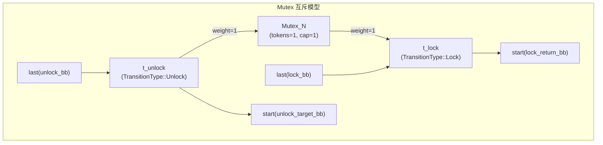
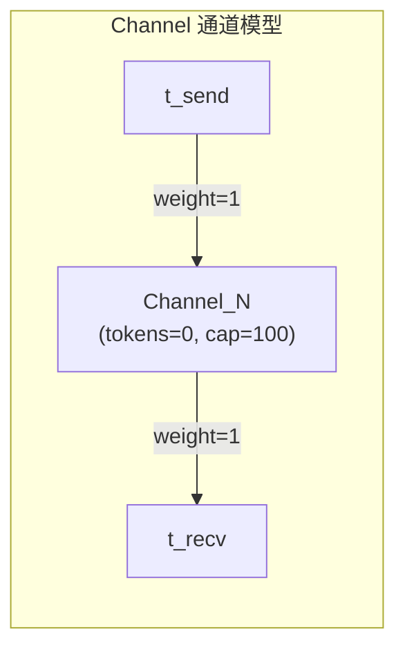
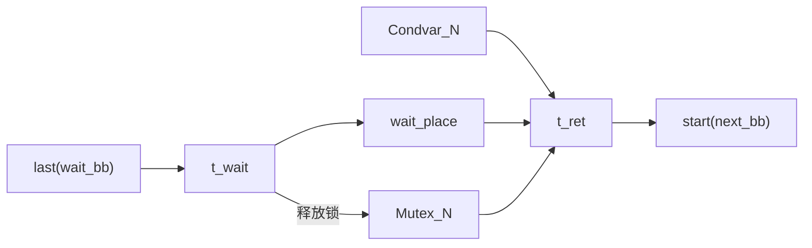
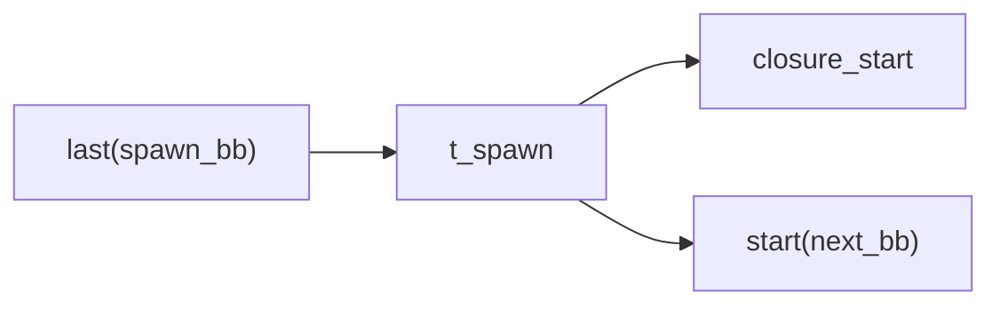
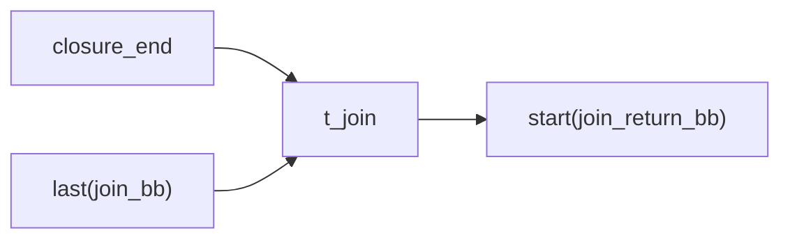
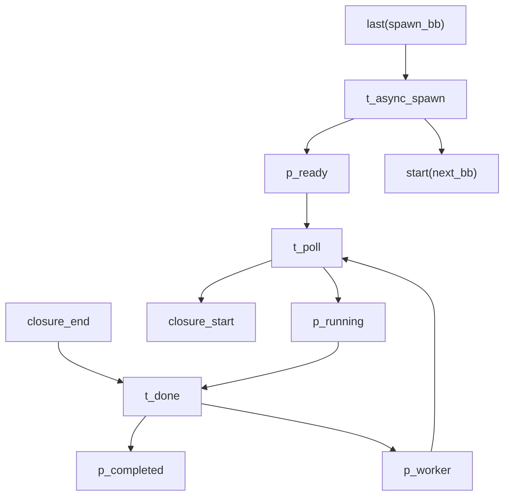

# 同步原语的 Petri 网模型

本文档详细描述 RustPTA 如何将 Rust 的各种同步原语（Mutex、RwLock、Channel、Condvar、Thread、Async Task、Atomic）建模为 Petri 网结构。每种原语都有其特定的资源库所和变迁模式，通过 token 的流动精确刻画并发语义。

## Mutex（互斥锁）

### 资源库所

每组互斥锁（通过别名分析合并后的等价类）对应一个资源库所：

- **初始 token**: 1
- **容量**: 1

实现位于 `src/translate/petri_net.rs` 的 `construct_lock_with_dfs`。

### Lock 变迁

当代码调用 `mutex.lock()` 时，生成一个 `Lock` 类型变迁，通过输入弧从资源库所消耗 1 个 token：

```
Mutex_N ──[weight=1]──> t_lock ──> start(next_bb)
last(bb) ──────────────> t_lock
```

如果资源库所中没有 token（锁已被持有），`t_lock` 变迁不可使能，该执行路径被阻塞——这正是互斥语义的精确表达。

### Unlock 变迁

锁的释放有两种触发方式：

1. **显式 drop**：代码中显式调用 `drop(guard)` 或 `std::mem::drop(guard)`。
2. **隐式 drop**：`MutexGuard` 在作用域结束时自动 drop（MIR 中的 `Drop` 终止符）。

两种情况都生成 `Unlock` 类型变迁，通过输出弧向资源库所归还 1 个 token：

```
last(bb) ──> t_unlock ──> start(next_bb)
                |
                └──[weight=1]──> Mutex_N（归还 token）
```

### 完整 Mutex 模型



### 死锁检测原理

如果两个线程分别持有锁 A 和锁 B，并试图获取对方持有的锁，则两个 `Lock` 变迁都因资源库所缺少 token 而不可使能，Petri 网进入死锁状态（无可使能变迁且未到达正常终止标识）。

### 锁别名合并

RustPTA 使用 Union-Find 合并可能引用同一底层 Mutex 的锁守卫。对于每对锁守卫，通过 `AliasAnalysis::alias()` 查询别名关系，如果可能别名（`may_alias` 返回 `true`），则将它们合并到同一组，共享同一个资源库所。

支持的锁类型：
- `std::sync::Mutex` / `MutexGuard`
- `parking_lot::Mutex` / `MutexGuard`
- `spin::Mutex` / `MutexGuard`

## RwLock（读写锁）

### 资源库所

- **初始 token**: 10
- **容量**: 10

使用较大的 token 数量来区分读锁和写锁的并发能力。

### 读锁 (RwLockRead)

读锁获取消耗 1 个 token，释放归还 1 个 token。由于资源库所有 10 个 token，最多允许 10 个并发读者。

```
RwLock_N ──[weight=1]──> t_read_lock
t_read_unlock ──[weight=1]──> RwLock_N
```

### 写锁 (RwLockWrite)

写锁获取消耗 10 个 token（耗尽资源库所），释放归还 10 个 token。写锁独占所有 token，因此读锁和其他写锁都无法同时获取。

```
RwLock_N ──[weight=10]──> t_write_lock
t_write_unlock ──[weight=10]──> RwLock_N
```

### 并发语义

| 场景 | 资源库所 token 变化 | 是否允许 |
|------|-------------------|---------|
| 1 个读者 | 10 → 9 | 允许 |
| 10 个并发读者 | 10 → 0 | 允许（已满） |
| 11 个并发读者 | 0（不足 1） | 阻塞 |
| 1 个写者 | 10 → 0 | 允许（独占） |
| 1 个写者 + 1 个读者 | 0（不足 1） | 阻塞 |
| 2 个写者 | 0（不足 10） | 阻塞 |

## Channel（通道）

### 资源库所

每对 Sender/Receiver 共享一个资源库所：

- **初始 token**: 0（通道初始为空）
- **容量**: 100

实现位于 `src/translate/petri_net.rs` 的 `construct_channel_resources`。

### Sender/Receiver 配对

`ChannelCollector`（`src/concurrency/channel.rs`）分析 MIR 中的 `Sender<T>` 和 `Receiver<T>` 类型。通过别名分析确定哪些 Sender 和 Receiver 属于同一个 channel（即来自同一次 `channel()` 调用），将它们关联到同一个资源库所。

### Send 变迁

发送操作通过输出弧向通道资源库所添加 1 个 token：

```
last(send_bb) ──> t_send ──> start(next_bb)
                    |
                    └──[weight=1]──> Channel_N（生产 token）
```

### Recv 变迁

接收操作通过输入弧从通道资源库所消费 1 个 token：

```
Channel_N ──[weight=1]──> t_recv ──> start(next_bb)
last(recv_bb) ──────────> t_recv
```

如果通道为空（token=0），`t_recv` 不可使能，接收方阻塞。

### 通道模型示意



## Condvar（条件变量）

### 资源库所

- **初始 token**: 1
- **容量**: 1

实现位于 `src/translate/petri_net.rs` 的 `collect_blocking_primitives`。

### Notify 变迁

`condvar.notify_one()` 或 `condvar.notify_all()` 生成 `Notify` 变迁，向 condvar 资源库所添加 1 个 token：

```
last(notify_bb) ──> t_notify ──> start(next_bb)
                      |
                      └──[weight=1]──> Condvar_N
```

### Wait 变迁

`condvar.wait(guard)` 的语义较为复杂，涉及三个步骤：释放锁、等待通知、重新获取锁。RustPTA 使用 wait-ret 子网建模：



弧连接详情：

| 弧 | 方向 | 权重 | 含义 |
|----|------|------|------|
| `Mutex_N → t_wait` | 输出弧 | 1 | wait 释放锁 |
| `Condvar_N → t_ret` | 输入弧 | 1 | 等待通知信号 |
| `Mutex_N → t_ret` | 输入弧 | 1 | 重新获取锁 |
| `wait_place → t_ret` | 输入弧 | 1 | 等待中 token |

## Thread（线程）

### Spawn 变迁

`std::thread::spawn(closure)` 创建新线程。在 Petri 网中，spawn 变迁同时启动闭包和延续调用者的执行：



`t_spawn` 变迁有两个输出弧——一个连接闭包的入口库所（启动子线程），一个连接调用者的后续基本块（调用者继续执行）。这样产生了并发执行语义：token 同时出现在两条路径上。

### Join 变迁

`handle.join()` 等待子线程完成。join 变迁需要子线程的出口库所有 token 才能发生：



### Spawn-Join 匹配

通过 `get_matching_spawn_callees(join_id)` 利用别名分析找到 join 对应的 spawn 目标函数。如果 `JoinHandle` 可能指向多个 spawn（模糊别名），当前实现只选取第一个匹配。

### Scope spawn/join

Scoped thread（`std::thread::scope`）的处理与普通 spawn/join 类似，但有额外约束：

- **ScopeSpawn**：闭包的 start 连接到 spawn 变迁，闭包的 end 连接到 scope 的 return 变迁，确保 scope 退出时所有 scoped 线程已完成。
- **ScopeJoin**：通过 `AliasId` 匹配 scope 内的 spawn。

### Rayon join

`rayon::join(closure_a, closure_b)` 的建模使用 wait-ret 子网，多个闭包的 end 库所都连接到同一个 join 变迁：

```
closure_a_start <── t_rayon_call ──> closure_b_start
                         |
                    wait_place
closure_a_end ──> t_join <── closure_b_end
                    |
               wait_place
                    |
              start(return_bb)
```

## Async Spawn/Join (tokio)

### 任务生命周期库所

每个异步任务有三个生命周期库所（`src/translate/mir_to_pn/async_control.rs`）：

| 库所 | 含义 |
|------|------|
| `p_ready` | 任务已创建，等待被 poll |
| `p_running` | 任务正在 executor 上执行 |
| `p_completed` | 任务执行完毕 |

### Worker 库所

模拟 executor 的工作线程池。Worker 库所的 token 数量代表可用的工作线程数。

### Async Spawn 模型



**关键变迁**：

| 变迁 | 输入 | 输出 | 含义 |
|------|------|------|------|
| `t_spawn` | `last(bb)` | `p_ready`, `start(next_bb)` | 创建任务 |
| `t_poll` | `p_ready`, `p_worker` | `p_running`, `closure_start` | executor 调度执行任务 |
| `t_done` | `p_running`, `closure_end` | `p_completed`, `p_worker` | 任务完成，归还 worker |

### Async Join 模型

```
p_completed ──> t_join ──> start(join_return_bb)
last(join_bb) ──> t_join
```

join 需要 `p_completed` 有 token（任务已完成）才能发生。

## Atomic（原子操作）

原子操作有两种建模模式，取决于是否启用 `atomic-violation` feature。

### 基本模式（默认）

每个原子变量对应一个资源库所（tokens=1, capacity=1）。原子操作通过读-改-写模式建模：

```
last(bb) ──> t_atomic ──> intermediate_place ──> ...
                |                    ↑
            atomic_var ──────────────┘
            (input+output arc, weight=1)
```

资源库所同时作为输入和输出（自环），确保同一原子变量的操作互斥。

### atomic-violation 模式

启用 `atomic-violation` feature 后，使用更精细的变迁类型标签和内存序建模。

#### 变迁类型

| 变迁类型 | 含义 |
|---------|------|
| `AtomicLoad(alias, ordering, span, tid)` | 原子加载 |
| `AtomicStore(alias, ordering, span, tid)` | 原子存储 |
| `AtomicCmpXchg(alias, success_ord, failure_ord, span, tid)` | 原子比较-交换 |

#### 内存序建模

通过 segment places 建模不同内存序的 happens-before 关系（`src/translate/mir_to_pn/concurrency.rs`）：

| 内存序 | Petri 网模式 |
|--------|-------------|
| `Relaxed` | 当前 segment 库所自环（无序列化约束） |
| `Acquire` / `Release` / `AcqRel` | 当前 segment → 下一 segment 传递 token（建立 happens-before） |
| `SeqCst` | 额外使用全局 `SeqCst_Global` 库所（全序排列） |

```
Relaxed:
  seg_current ──[input]──> t_atomic ──[output]──> seg_current（自环）

Acquire/Release:
  seg_current ──[input]──> t_atomic ──[output]──> seg_next（推进 segment）

SeqCst:
  seg_current + SeqCst_Global ──> t_atomic ──> seg_next + SeqCst_Global
```

## 同步原语识别

RustPTA 通过正则表达式匹配 MIR 中的函数调用来识别同步原语（配置于 `src/config.rs`）：

| 原语 | 默认正则模式 |
|------|-------------|
| Thread Spawn | `std::thread[...]::spawn`, `tokio::task::spawn` 等 |
| Thread Join | `std::thread[...]::join`, `tokio::task::JoinHandle::await` 等 |
| Condvar Notify | `condvar[...]::notify` |
| Condvar Wait | `condvar[...]::wait` |
| Channel Send | `mpsc[...]::send` |
| Channel Recv | `mpsc[...]::recv` |
| Atomic Load | `atomic[...]::load` |
| Atomic Store | `atomic[...]::store` |

锁的识别（Mutex/RwLock）则通过 `BlockingCollector`（`src/concurrency/blocking.rs`）分析 MIR 中 `MutexGuard`、`RwLockReadGuard`、`RwLockWriteGuard` 等类型的局部变量。

## 资源注册表

`ResourceRegistry`（`src/translate/structure.rs`）维护所有同步资源的 `AliasId` 到 `PlaceId` 的映射：

```rust
pub struct ResourceRegistry {
    locks: HashMap<AliasId, PlaceId>,
    condvars: HashMap<AliasId, PlaceId>,
    atomic_places: HashMap<AliasId, Vec<PlaceId>>,
    atomic_orders: HashMap<AliasId, AtomicOrdering>,
    unsafe_places: HashMap<AliasId, PlaceId>,
    channel_places: HashMap<AliasId, PlaceId>,
}
```

翻译过程中，`handle_lock_call`、`handle_channel_call` 等函数通过别名 ID 查找对应的资源库所，建立正确的弧连接。

## 总结：同步原语对照表

| 原语 | 资源库所 | 初始 token | 获取（消耗） | 释放（归还） |
|------|---------|-----------|-------------|-------------|
| Mutex | `Mutex_N` | 1 | Lock: 1 | Unlock: 1 |
| RwLock (Read) | `RwLock_N` | 10 | RwLockRead: 1 | Unlock: 1 |
| RwLock (Write) | `RwLock_N` | 10 | RwLockWrite: 10 | Unlock: 10 |
| Channel | `Channel_N` | 0 | - | Send: +1 |
| Channel (Recv) | `Channel_N` | 0 | Recv: 1 | - |
| Condvar | `Condvar_N` | 1 | Wait: 1 (via ret) | Notify: +1 |
| Atomic | `Atomic_N` | 1 | 自环: 1 | 自环: 1 |
