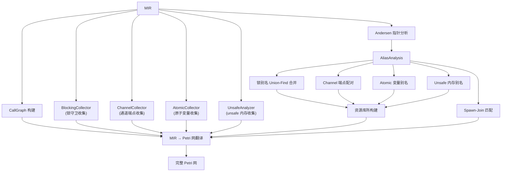
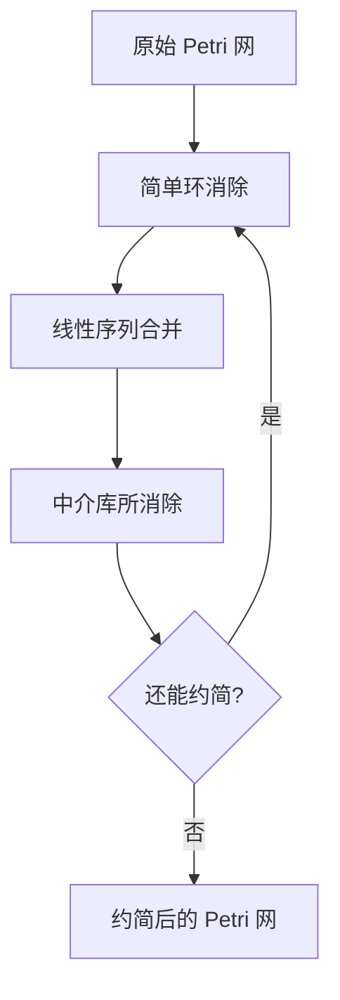
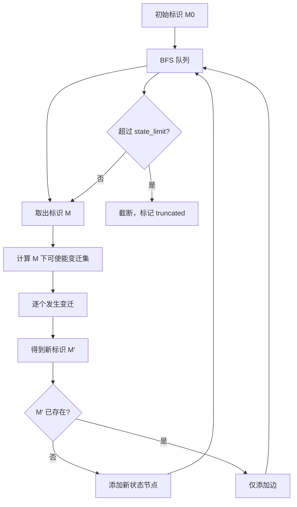

# 指针分析与缺陷检测

本文档描述 RustPTA 中指针分析如何与 Petri 网结合，以及状态空间探索、Petri 网约简和三种缺陷检测算法的工作原理。

## 指针分析与 Petri 网的结合

指针分析是 Petri 网构建过程中的关键前置步骤。它解决的核心问题是：当多个变量可能引用同一个锁、通道或原子变量时，如何在 Petri 网中正确地将它们关联到同一个资源库所。



### Andersen 指针分析

RustPTA 实现了基于约束的 Andersen 风格指针分析（`src/memory/pointsto.rs`），这是一种流不敏感 (flow-insensitive) 的全程序指针分析。

#### 约束图

分析的核心是构建约束图，图中的节点和边表示指针关系：

**约束节点 (`ConstraintNode`)**:
| 节点类型 | 含义 |
|---------|------|
| `Alloc(PlaceRef)` | 内存分配点 |
| `Place(PlaceRef)` | 程序中的内存位置 |
| `Constant` | 常量 |
| `ConstantDeref` | 常量的解引用 |

**约束边 (`ConstraintEdge`)**:
| 边类型 | 含义 | 对应 MIR 操作 |
|--------|------|-------------|
| `Address` | 取地址 (`&x`) | `Rvalue::Ref` |
| `Copy` | 拷贝赋值 (`a = b`) | `Rvalue::Use` |
| `Load` | 加载 (`a = *b`) | 解引用读 |
| `Store` | 存储 (`*a = b`) | 解引用写 |
| `AliasCopy` | 特殊别名拷贝 | `Arc/Rc::clone` 等 |

#### 工作列表求解

`ConstraintGraphCollector` 遍历所有函数的 MIR body，生成约束图后通过工作列表算法传播 points-to 信息，直到达到不动点：

1. 初始化：每个 `Alloc` 节点的 points-to 集合包含自身。
2. 传播规则：
   - `Address(a → b)`：`pts(b) ⊇ {a}`
   - `Copy(a → b)`：`pts(b) ⊇ pts(a)`
   - `Load(a → b)`：对 `pts(a)` 中每个 `c`，`pts(b) ⊇ pts(c)`
   - `Store(a → b)`：对 `pts(b)` 中每个 `c`，`pts(c) ⊇ pts(a)`
3. 支持 field 传播，处理结构体字段的别名关系。

#### 特殊处理

- **`Arc/Rc::clone`**：识别为 `AliasCopy`，确保克隆后的引用指向同一对象。
- **`ptr::read`**：作为 load 处理。
- **索引操作**：`container.index()` 作为 load 处理。

### 别名分析接口

`AliasAnalysis`（`src/memory/pointsto.rs`）提供统一的别名查询接口：

```rust
pub struct AliasId {
    instance_id: usize,    // 函数实例 ID
    local: usize,          // MIR 局部变量索引
    array_index: Option<usize>, // 数组索引（区分 arr[0] 与 arr[1]）
}
```

**别名查询结果 (`ApproximateAliasKind`)**:
| 结果 | 含义 |
|------|------|
| `Probably` | 很可能别名（同一分配点） |
| `Possibly` | 可能别名（points-to 集有交集） |
| `Unlikely` | 不太可能别名 |
| `Unknown` | 无法确定 |

**别名未知策略 (`AliasUnknownPolicy`)**:
- **`Conservative`（保守/sound）**：将 `Unknown` 视为 `Possibly`，添加弧连接，减少漏报但可能增加误报。
- **`Optimistic`（乐观）**：将 `Unknown` 视为 `Unlikely`，不添加弧，减少误报但可能增加漏报。

### 别名分析在 Petri 网构建中的应用

| 应用场景 | 实现位置 | 作用 |
|---------|---------|------|
| 锁别名合并 | `petri_net.rs::construct_lock_with_dfs` | 将可能引用同一 Mutex 的守卫合并到同一资源库所 |
| Channel 端点配对 | `petri_net.rs::construct_channel_resources` | 将同一 channel 的 Sender 和 Receiver 关联到同一资源库所 |
| Spawn-Join 匹配 | `callgraph.rs::get_matching_spawn_callees` | 确定 `JoinHandle` 对应的 spawn 目标函数 |
| Unsafe 内存冲突 | `drop_unsafe.rs::process_rvalue_reads/writes` | 判断内存操作是否涉及 unsafe 共享资源 |
| Atomic 变量别名 | `petri_net.rs::construct_atomic_resources` | 合并指向同一原子变量的别名 |

## Petri 网约简

Petri 网约简（`src/net/reduce/`）通过结构变换减小网的规模，同时保持行为属性（活性、有界性、可达性等）。

### 约简框架

`Reducer` 按顺序应用三种约简规则，每种规则可能多次应用直到无法继续：



### 简单环消除 (`loop_removal.rs`)

**条件**：
- 存在库所链 $p_1, p_2, \ldots, p_k$ 和变迁链 $t_1, t_2, \ldots, t_k$ 形成简单环。
- 每个库所非 `Resources` 类型，`|{\bullet}p| = |p{\bullet}| = 1`。
- 每个变迁 `|{\bullet}t| = |t{\bullet}| = 1`。
- 所有库所 token 为 0。

**操作**：移除环中所有库所和变迁。

### 线性序列合并 (`sequence_merge.rs`)

**条件**：
- 存在线性链 $p_1 \to t_1 \to p_2 \to t_2 \to \ldots \to p_k$，链长 $k \geq 2$。
- 中间库所非 `Resources` 类型，`|{\bullet}p_i| = |p_i{\bullet}| = 1`。
- 中间变迁 `|{\bullet}t_i| = |t_i{\bullet}| = 1`。
- 弧权一致。

**操作**：创建新变迁直接连接 $p_1$ 和 $p_k$，移除中间库所和变迁。

### 中介库所消除 (`intermediate_place.rs`)

**条件**：
- 库所 $p$ 的 token 为 0，非 `Resources` 类型。
- 唯一输入变迁 $t_{in}$，唯一输出变迁 $t_{out}$。
- $|t_{in}{\bullet}| = |{\bullet}t_{out}| = 1$，弧权相等。

**操作**：创建新变迁，输入为 ${\bullet}t_{in}$，输出为 $t_{out}{\bullet}$，移除 $p$、$t_{in}$ 和 $t_{out}$。

### 约简追踪

`ReductionTrace` 记录约简前后的库所和变迁 ID 映射关系，确保约简后的分析结果可以追溯到原始网中的位置。

## 状态空间探索

### 状态图构建

`StateGraph`（`src/analysis/reachability.rs`）通过 BFS 探索 Petri 网的可达标识集合，构建完整的状态图：



**状态节点 (`StateNode`)**：包含当前标识、各库所 token 数快照、可使能变迁列表。

**状态边 (`StateEdge`)**：记录触发的变迁、token 变化和弧快照。

### 偏序约简 (POR)

偏序约简通过 sleep set 技术减少等价交错的探索：

1. **独立性判断**：`transitions_are_independent(t1, t2)` 检查两个变迁是否不共享任何库所（无冲突）。
2. **Sleep set**：在每个状态维护一个 sleep set，已在兄弟状态中探索过的独立变迁不再重复探索。

POR 可以显著减少状态数量，同时保持死锁和其他安全性属性的可检测性。

### 有界性分析

`BoundnessAnalyzer`（`src/analysis/boundness.rs`）检查 Petri 网是否有界：

1. **P-不变量方法**：如果存在正的 P-不变量（需 `invariants` feature），则网有界。
2. **覆盖树方法**：构建覆盖树，如果出现 $\omega$ 标记（无界增长），则网无界，并回溯生成 witness 序列。

## 缺陷检测

### 死锁检测 (`src/detect/deadlock.rs`)

`DeadlockDetector` 在状态图中检测两种死锁模式：

#### 可达性死锁

在状态图中寻找无出边的状态（死锁标识），且该状态不是正常终止状态（`main` 函数的 `func_end` 库所无 token）。

**判定条件**：
- 状态无出边（无可使能变迁）
- `func_end` 库所 token 为 0（程序未正常结束）

#### 循环死锁

在状态图中找到强连通分量 (SCC) 或环，检查环中是否包含持续不可使能的 `Lock`/`RwLockRead`/`RwLockWrite` 变迁。

**判定条件**：
- 存在状态环
- 环中至少一个 `Lock` 变迁在所有环中状态下都不可使能

### 数据竞争检测 (`src/detect/datarace.rs`)

`DataRaceDetector` 在可达状态图中检测对同一内存位置的不安全并发访问。

**检测逻辑**：

1. 对每个可达状态，收集所有可使能的 `UnsafeRead(alias_id, ...)` 和 `UnsafeWrite(alias_id, ...)` 变迁。
2. 按 `alias_id`（内存位置标识）分组。
3. 如果同一 `alias_id` 上存在至少两个并发操作，且其中至少一个是写操作，则报告数据竞争。

**关键依赖**：

- `UnsafeRead`/`UnsafeWrite` 变迁由 `drop_unsafe.rs` 中的 `process_rvalue_reads`/`process_place_writes` 生成。
- 只有经过 unsafe 别名分析确认涉及共享 unsafe 内存的操作才会生成这些变迁。

### 原子性违反检测

原子性违反检测有两种实现，取决于是否启用 `atomic-violation` feature。

#### 基于 StateGraph 的检测 (`src/detect/atomicity_violation.rs`)

使用三条规则在可达状态序列中搜索违反原子性的操作模式：

| 模式 | 含义 | 风险 |
|------|------|------|
| Load-Store-Store (AV1) | 线程 A 读、线程 B 写、线程 A 写 | Lost update |
| Store-Store-Load (AV2) | 线程 A 写、线程 B 写、线程 A 读 | 读到意外值 |
| Load-Store-Load (AV3) | 线程 A 读、线程 B 写、线程 A 读 | Non-repeatable read |

通过 `StateFingerprint` 去重，避免重复报告相同的违反模式。

#### 基于 Petri 网的检测 (`src/detect/atomic_violation_detector.rs`)

直接在 Petri 网上运行，不需要预先构建完整状态图：

1. 收集所有 `AtomicLoad` 和 `AtomicStore` 变迁。
2. 对每个 load，沿变迁的前驱边（反向）搜索可能先于它执行的 store。
3. 如果同一原子变量上存在 1 个 load 和至少 2 个来自不同线程的 store，且内存序允许重排（`ordering_allows`），则报告原子性违反。

**内存序匹配规则**：
| Load 序 | 允许匹配的 Store 序 |
|---------|-------------------|
| `Acquire` | `Release`, `AcqRel`, `SeqCst` |
| `SeqCst` | 仅 `SeqCst` |
| `Relaxed` | 所有 |

## 报告输出

检测结果通过结构化报告输出（`src/report/mod.rs`），同时生成文本和 JSON 两种格式。

### DeadlockReport

```json
{
  "tool_name": "Petri Net Deadlock Detector",
  "has_deadlock": true,
  "deadlock_count": 1,
  "deadlock_states": [
    {
      "state_id": 42,
      "marking": { "Mutex_0": 0, "Mutex_1": 0, "bb3_thread1": 1, "bb5_thread2": 1 },
      "description": "Both threads blocked waiting for each other's lock"
    }
  ],
  "traces": [...],
  "analysis_time": "0.123s",
  "state_space_info": { "states": 150, "edges": 200 }
}
```

### RaceReport

```json
{
  "tool_name": "Petri Net Data Race Detector",
  "has_race": true,
  "race_count": 1,
  "race_conditions": [
    {
      "operations": [
        { "operation_type": "UnsafeWrite", "variable": "shared_var", "location": "src/main.rs:15" },
        { "operation_type": "UnsafeRead", "variable": "shared_var", "location": "src/main.rs:22" }
      ],
      "variable_info": "shared_var",
      "state": 55
    }
  ]
}
```

### AtomicReport

```json
{
  "tool_name": "Petri Net Atomic Violation Detector",
  "has_violation": true,
  "violation_count": 1,
  "violations": [
    {
      "load_op": { "operation_type": "load@tid0", "ordering": "Relaxed", "variable": "counter" },
      "store_ops": [
        { "operation_type": "store@tid1", "ordering": "Relaxed", "variable": "counter" },
        { "operation_type": "store@tid0", "ordering": "Relaxed", "variable": "counter" }
      ]
    }
  ]
}
```

## 已知局限性

详见 `limition.md`，主要局限包括：

1. **别名分析精度**：在处理资源竞争时倾向于欠近似，可能漏报。
2. **内存模型**：对 Acquire/Release 的 Petri 网建模是启发式的，Relaxed 序处理较简化。
3. **控制流**：不支持无限递归；panic 路径简化处理。
4. **FFI**：不支持对 C/C++ 代码的分析。
